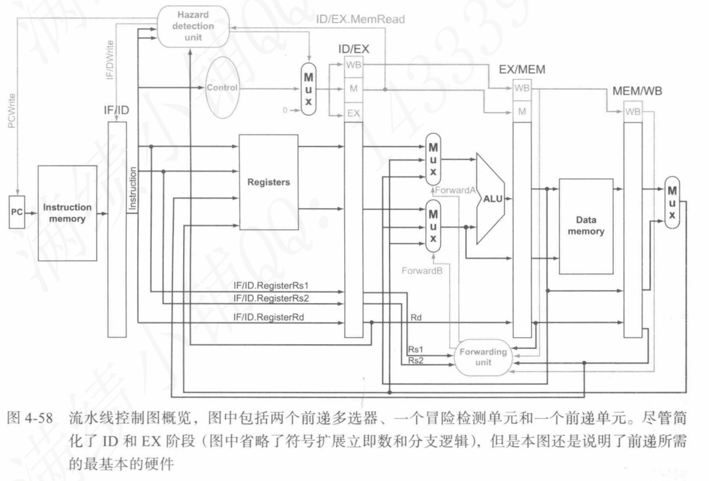

# 面向验收指导文档

$$
Fuck\ The\ Prof\bf{\textit{！}}\\

Fuck\ The\ Training\ Plan\bf{\textit{！}}\\

Fuck\ The\ School\ of\ Computer\ Science\bf{\textit{！}}\\

Fuck\ The\ Wuhan\ University\ Management\ Layer\bf{\textit{！}}\\

\textit{有用的话给Arielle点个Star谢谢喵}\bf{\textit{！}}
$$

模块的包含结构如下：

```
top_module (FPGA顶层)
├── sccomp (CPU系统)
│   ├── PipelineCPU (五级流水线CPU)
│   │   ├── PC_NPC (程序计数器和下一条指令地址计算)
│   │   │
│   │   ├── IF_ID_Reg (IF/ID流水线寄存器)
│   │   │
│   │   ├── ctrl (控制单元)
│   │   ├── EXT (立即数扩展)
│   │   ├── RF (寄存器文件)
│   │   ├── HazardDetectionUnit (冒险检测单元)
│   │   │
│   │   ├── ID_EX_Reg (ID/EX流水线寄存器)
│   │   │
│   │   ├── alu (算术逻辑单元)
│   │   ├── ForwardingUnit (前递单元)
│   │   │
│   │   ├── EX_MEM_Reg (EX/MEM流水线寄存器)
│   │   │
│   │   ├── dm (数据存储器)
│   │   │
│   │   └── MEM_WB_Reg (MEM/WB流水线寄存器)
│   └── im (指令存储器)
└── seg7_controller (七段数码管控制器)
```


# IF

这个部分的全部硬件为：

- PC_NPC（程序计数器和下一条指令地址计算）

## 定义

### PC_NPC

```verilog
`include "ctrl_encode_def.v"

module PC_NPC(
    input clk,
    input rst,
    input stall,
    input [31:0] base_PC,
    input [2:0] NPCOp,
    input [31:0] IMM,
    input [31:0] aluout,
    output reg [31:0] PC
);
    
    wire [31:0] PCPLUS4;
    wire [31:0] NPC;
    
    assign PCPLUS4 = PC + 4; // pc + 4
    
    // NPC计算逻辑
    always @(*) begin
        case (NPCOp)
            `NPC_PLUS4:  NPC = PCPLUS4;
            `NPC_BRANCH: NPC = base_PC + IMM;
            `NPC_JUMP:   NPC = base_PC + IMM;
            `NPC_JALR:   NPC = aluout;
            default:     NPC = PCPLUS4;
        endcase
    end
    
    // PC更新逻辑
    always @(posedge clk, posedge rst) begin
        if (rst) 
            PC <= 32'h0000_0000;
        else if (!stall)
            PC <= NPC;
        else
            PC <= PC;
    end
      
endmodule
```

- 这是主要的模块，集成了PC和NPC的功能。
- NPCOp, IMM, aluout接收控制信号等和跳转指令有关的指示数据。
- 该模块以此决定将什么指令向后发送。
- 当stall=1时PC保持不变。

## 实例化

### PC_NPC

```verilog
// IF stage
    PC_NPC pc_npc_unit(
        .clk(clk),
        .rst(rst),
        .stall(stall_IF),
        .base_PC(npc_base_pc),
        .NPCOp(npc_op_sel),
        .IMM(npc_imm_sel),
        .aluout(alu_result_EX),
        .PC(PC_IF)
    );
```

## 理解过程

你的疑惑：

- 这里npc_op_sel，npc_imm_sel，npc_base_pc三个信号是从何而来，起什么作用？

对应理解：

- 这些信号由HazardDetectionUnit生成，用于处理控制冒险。
- 检测到JAL类型指令时，说明控制冒险发生，流水线应插入空泡。
- 事实：一个指令对应的，在其全执行过程内需要用到的控制信号，由该指令的编码唯一确定。
- 回顾：为什么有控制冒险？
  - 在 IF 阶段：我们不知道当前是否该跳转，先默认 `PC+4`。
  - 在 ID 阶段：解码出 `jal`，立即数 `imm` 可以拿到，跳转地址 = `PC + imm`也可以立刻拿到。
  - ⚠️ 此时，**下一条指令已经被 IF 取出（PC+4 的那一条），如果 jal 真要跳，就必须丢弃这条指令**
  - 这个"下一条指令"现在在哪？在 IF 阶段的硬件。
  - 显然，这就是我们正在设计的硬件。
- 对于JAL指令，跳转地址由指令本身直接可以给出
  - 如果JAL引起了跳转，那么这个JAL现在位于ID
  - 显然，我们要从流水线寄存器获得它
- 对于JALR指令，跳转地址要由给定的寄存器和偏移量相加得到
  - 如果JALR引起了跳转，那么这个JALR现在位于EX。
  - 显然，我们要从流水线寄存器获得它。

# IF-ID流水线寄存器

```verilog
module IF_ID_Reg(
    input clk,
    input rst,
    input flush,
    input stall,
    input [31:0] PC_in,
    input [31:0] instr_in,
    output reg [31:0] PC_out,
    output reg [31:0] instr_out
);
    always @(posedge clk or posedge rst) begin
        if (rst) begin
            PC_out <= 32'h0;
            instr_out <= 32'h0;
        end
        else if (flush) begin
            PC_out <= 32'h0;
            instr_out <= 32'h0;
        end
        else if (!stall) begin
            PC_out <= PC_in;
            instr_out <= instr_in;
        end
    end
endmodule
```

## 实例化

```verilog
// IF-ID流水线寄存器
    IF_ID_Reg if_id_reg(
        .clk(clk),
        .rst(rst),
        .flush(flush_IF),
        .stall(stall_IF),
        .PC_in(PC_IF),
        .instr_in(instr_IF),
        .PC_out(PC_ID),
        .instr_out(instr_ID)
    );
```

## 理解过程

你的疑惑：

1. 这个流水线寄存器在时序上的行为是如何的？

对应理解：

1. 在任何时刻，都正在接受IF阶段取出的指令数据作为输入，将ID阶段正在执行的指令数据作为输出。

	- 事实：

		- 0：在任何一个时钟周期内，流水线寄存器总是接受输入数据和输出数据。

		- 1：寄存器的行为是，在当前周期内输出内部存储的值至输出口，在下个周期内将当前周期输入口的数据写到内部存储并将这个数据作为新的输出值。

		- 2：此流水线寄存器的控制信号只用于管理自身状态，不向后传输。

	- 结论：
		- 0：该寄存器输出的指令数据是当前时钟周期内ID正在执行的指令。
		- 1：该寄存器被输入的指令数据是当前时钟周期内IF刚刚取到的指令。

# ID

这个部分的全部硬件为：

- CTRL控制单元（ctrl）
- 冒险检测单元（HazardDetectionUnit）
- 前递单元（ForwardingUnit）
- 立即数生成单元（EXT）
- 寄存器文件（RF）

## 定义

### CTRL

```verilog
`include "ctrl_encode_def.v"

module ctrl(input  [6:0] Op;       // opcode
            input  [6:0] Funct7;    // funct7
            input  [2:0] Funct3;    // funct3
            input        Zero;
            
            output       RegWrite; // control signal for register write
            output       MemWrite; // control signal for memory write
            output       MemRead;  // control signal for memory read
            output [5:0] EXTOp;    // control signal to signed extension
            output [4:0] ALUOp;    // ALU opertion
            output [2:0] NPCOp;    // next pc operation
            output       ALUSrc;   // ALU source for A
            output [2:0] DMType;   // Data memory access type
            output [1:0] GPRSel;   // general purpose register selection
            output [1:0] WDSel;    // (register) write data selection
            );
            
   // ------------------------------------------------------------
   // Instruction type encoding begins
   // Instruction type detection
   wire lui     = (Op == `OPCODE_LUI);
   wire auipc    = (Op == `OPCODE_AUIPC);
   wire jal      = (Op == `OPCODE_JAL);
   wire jalr     = (Op == `OPCODE_JALR);
   wire branch   = (Op == `OPCODE_BRANCH);
   wire load     = (Op == `OPCODE_LOAD);
   wire store    = (Op == `OPCODE_STORE);
   wire op_imm   = (Op == `OPCODE_OP_IMM);
   wire op       = (Op == `OPCODE_OP);
   

   //balabala，省略
   
   // Register arithmetic/logical instructions
   wire add      = op & (Funct3 == `FUNCT3_ADD) & (Funct7 == `FUNCT7_ADD);
   wire sub      = op & (Funct3 == `FUNCT3_SUB) & (Funct7 == `FUNCT7_SUB);
   wire sll      = op & (Funct3 == `FUNCT3_SLL);
   wire slt      = op & (Funct3 == `FUNCT3_SLT);
   wire sltu     = op & (Funct3 == `FUNCT3_SLTU);
   wire xor_op   = op & (Funct3 == `FUNCT3_XOR);
   wire srl      = op & (Funct3 == `FUNCT3_SRL) & (Funct7 == `FUNCT7_SRL);
   wire sra      = op & (Funct3 == `FUNCT3_SRA) & (Funct7 == `FUNCT7_SRA);
   wire or_op    = op & (Funct3 == `FUNCT3_OR);
   wire and_op   = op & (Funct3 == `FUNCT3_AND);

   // instruction type encoding ends
   // ------------------------------------------------------------
   

   // ------------------------------------------------------------
   // Control signals generation begins
   // Generate control signals
   assign RegWrite = lui | auipc | jal | jalr | load | addi | slti | sltiu | xori | ori | andi | slli | srli | srai | add | sub | sll | slt | sltu | xor_op | srl | sra | or_op | and_op;
   assign MemWrite = store;
   assign MemRead = load;
   assign ALUSrc = auipc | jal | jalr | load | store | addi | slti | sltiu | xori | ori | andi | slli | srli | srai;
   
   // Signed extension control
   assign EXTOp[5] = slli | srli | srai;  // ITYPE_SHAMT
   assign EXTOp[4] = addi | slti | sltiu | xori | ori | andi | jalr;  // ITYPE
   assign EXTOp[3] = store;  // STYPE
   assign EXTOp[2] = branch;  // BTYPE
   assign EXTOp[1] = lui | auipc;  // UTYPE
   assign EXTOp[0] = jal;  // JTYPE
   
   // Write data selection
   assign WDSel[1] = jal | jalr;
   assign WDSel[0] = load;
   
   // Next PC operation
   assign NPCOp[2] = jalr;
   assign NPCOp[1] = jal;
   assign NPCOp[0] = (beq & Zero) | (bne & ~Zero) | (blt & ~Zero) | (bge & Zero) | (bltu & ~Zero) | (bgeu & Zero);
   
   // ALU operation encoding
   assign ALUOp[4] = lui | auipc;
   assign ALUOp[3] = (addi | add) | (slti | slt) | (sltiu | sltu) | (xori | xor_op) | (ori | or_op) | (andi | and_op);
   assign ALUOp[2] = (slli | sll) | (srli | srl) | (srai | sra) | (xori | xor_op) | (ori | or_op) | (andi | and_op);
   assign ALUOp[1] = (sub | srl | sra) | (slti | slt) | (sltiu | sltu) | (xori | xor_op) | (ori | or_op) | (andi | and_op) | (beq | bne) | (blt | bge) | (bltu | bgeu);
   assign ALUOp[0] = (addi | add) | (sub) | (slti | slt) | (sltiu | sltu) | (xori | xor_op) | (ori | or_op) | (andi | and_op) | (slli | sll) | (srli | srl) | (srai | sra) | (load | store) | jalr;
   
   // Data memory access type
   assign DMType[2] = lbu | lhu;
   assign DMType[1] = lh | lhu | sh;
   assign DMType[0] = lb | lbu | sb;

   // Control signals generation ends
   // ------------------------------------------------------------
   
   // Register selection
   assign GPRSel = `GPRSel_RD;

endmodule

```

- 该模块生成控制信号，内部可以分为：

	- 指令字段分离为更直观的wire信号，以便生成控制信号。
	- 正式计算控制信号。

- 控制信号标准编码如下：

	- NPCOp — Next PC Operation（跳转控制）

  | 编码 (`NPCOp`) | 三位二进制 | 含义               | 适用指令                                   |
  | -------------- | ---------- | ------------------ | ------------------------------------------ |
  | `000`          | `3'b000`   | 顺序执行：PC + 4   | 非跳转指令                                 |
  | `001`          | `3'b001`   | 条件分支跳转       | `beq`, `bne`, `blt`, `bge`, `bltu`, `bgeu` |
  | `010`          | `3'b010`   | 无条件跳转（jal）  | `jal`                                      |
  | `100`          | `3'b100`   | 寄存器跳转（jalr） | `jalr`                                     |

	- EXTOp — Immediate Extension Type（立即数类型）
	
   | 位号     | 含义                       | 适用指令类型 / 指令                                    |
   | -------- | -------------------------- | ------------------------------------------------------ |
   | EXTOp[5] | I-type 移位立即数（shamt） | `slli`, `srli`, `srai`                                 |
   | EXTOp[4] | I-type 普通立即数          | `addi`, `slti`, `sltiu`, `xori`, `ori`, `andi`, `jalr` |
   | EXTOp[3] | S-type 存储型立即数        | `sw`, `sh`, `sb`                                       |
   | EXTOp[2] | B-type 分支型立即数        | `beq`, `bne`, `blt`, `bge`, `bltu`, `bgeu`             |
   | EXTOp[1] | U-type 高位立即数          | `lui`, `auipc`                                         |
   | EXTOp[0] | J-type 跳转立即数          | `jal`                                                  |

	- WDSel — Write Data Select（寄存器写回数据来源）
   | 编码 (`WDSel`) | 二位二进制 | 含义                     | 适用指令          |
   | -------------- | ---------- | ------------------------ | ----------------- |
   | `00`           | `2'b00`    | ALU 计算结果             | 普通算术/逻辑指令 |
   | `01`           | `2'b01`    | 数据存储器读取数据（DM） | `load`            |
   | `10`           | `2'b10`    | 跳转返回地址（PC + 4）   | `jal`, `jalr`     |
   | `11`           | `2'b11`    | 保留/未定义              | —                 |

	
	- ALUOp — ALU 操作选择（位掩码风格）
   | 位号     | 含义                                   | 典型指令                                    |
   | -------- | -------------------------------------- | ------------------------------------------- |
   | ALUOp[4] | 特殊类型（lui/auipc）                  | `lui`, `auipc`                              |
   | ALUOp[3] | 通用运算：加、比较、逻辑（or/xor/and） | `addi`, `slti`, `ori`, `andi`, `xor`, 等    |
   | ALUOp[2] | 位移类操作                             | `slli`, `srli`, `srai`, `sll`, `srl`, `sra` |
   | ALUOp[1] | 减法、比较、分支                       | `sub`, `slt`, `beq`, `bne`, `blt`, 等       |
   | ALUOp[0] | 加法/地址计算类                        | `addi`, `add`, `load`, `store`, `jalr`      |

	
	- DMType — 数据存储类型（字节对齐宽度）
	  
    | 编码 (`DMType`) | 三位二进制 | 含义                | 典型指令          |
    | --------------- | ---------- | ------------------- | ----------------- |
    | `000`           | `3'b000`   | word（32-bit）      | `lw`, `sw`        |
    | `001`           | `3'b001`   | byte（8-bit）       | `lb`, `lbu`, `sb` |
    | `010`           | `3'b010`   | half-word（16-bit） | `lh`, `lhu`, `sh` |
    
  - GPRSel — 通用目的寄存器选择，在risc-v中没有意义

### HazardDetectionUnit

```verilog
`include "ctrl_encode_def.v"
// 危险检测单元 - 检测和处理流水线中的数据冒险和控制冒险
// 该模块实现了Load-Use冒险检测和分支控制冒险检测
module HazardDetectionUnit(
    input [4:0] rs1_ID, rs2_ID,    // ID阶段的源寄存器地址
    input [4:0] rd_EX, rd_MEM,     // EX和MEM阶段的目标寄存器地址
    input MemRead_EX,              // EX阶段是否为Load指令
    input RegWrite_EX, RegWrite_MEM, // EX和MEM阶段是否写寄存器
    input [6:0] opcode_EX,         // EX阶段的opcode，用于检测分支指令
    input [2:0] funct3_EX,         // EX阶段的funct3，用于检测分支指令
    input branch_taken_EX,         // EX阶段分支是否被采取
    input [6:0] opcode_ID,         // ID阶段的opcode，用于检测JAL指令
    input [31:0] imm_EX,           // EX阶段的立即数
    input [31:0] imm_ID,           // ID阶段的立即数
    input [31:0] alu_result_EX,    // EX阶段ALU输出（JALR用）
    input [31:0] PC_EX,           // EX阶段PC
    input [31:0] PC_ID,           // ID阶段PC
    output reg stall_IF,           // 暂停IF阶段的信号
    output reg flush_IF,           // 清空IF阶段的信号
    output reg flush_ID,           // 清空ID阶段的信号
    output reg flush_EX,           // 清空EX阶段的信号
    output reg [2:0] NPCOp_out,
    output reg [31:0] NPCImm_out,
    output reg [31:0] base_PC_out
);
    // 检测是否为分支指令
    wire is_branch_EX;
    assign is_branch_EX = (opcode_EX == `OPCODE_BRANCH); // BRANCH opcode
    
    // 检测是否为JAL指令
    wire is_jal_ID;
    assign is_jal_ID = (opcode_ID == `OPCODE_JAL); // JAL opcode
    
    // 检测是否为JALR指令
    wire is_jalr_EX;
    assign is_jalr_EX = (opcode_EX == `OPCODE_JALR); // JALR opcode
    
    always @(*) begin
        // Load-Use冒险检测逻辑
        // 当EX阶段是Load指令且目标寄存器与ID阶段的源寄存器相同时会发生冒险
        // 此处处理的是Load与接下来第一条指令的冒险
        if (MemRead_EX && 
            ((rd_EX == rs1_ID && rs1_ID != 5'b0) ||    // EX阶段目标寄存器与ID阶段rs1相同
             (rd_EX == rs2_ID && rs2_ID != 5'b0))) begin // EX阶段目标寄存器与ID阶段rs2相同
            stall_IF = 1'b1;  // 暂停PC和IF/ID寄存器
            flush_IF = 1'b0;  // IF阶段不需要冲刷，stall会使其保持
            flush_ID = 1'b0;  // ID阶段不需要冲刷，stall会使其保持
            flush_EX = 1'b1;  // 向EX阶段插入一个气泡 (NOP)
        end
        // JALR优先级最高
        else if (opcode_EX == `OPCODE_JALR) begin
            stall_IF = 1'b0;
            flush_IF = 1'b1;
            flush_ID = 1'b1;
            flush_EX = 1'b0;
        end
        // Branch次之
        else if ((opcode_EX == `OPCODE_BRANCH) && branch_taken_EX) begin
            stall_IF = 1'b0;
            flush_IF = 1'b1;
            flush_ID = 1'b1;
            flush_EX = 1'b0;
        end
        else if (opcode_ID == `OPCODE_JAL) begin
            stall_IF = 1'b0;
            flush_IF = 1'b1;
            flush_ID = 1'b0;
            flush_EX = 1'b0;
        end
        else begin
            stall_IF = 1'b0;
            flush_IF = 1'b0;
            flush_ID = 1'b0;
            flush_EX = 1'b0;
        end


        // NPCOp/NPCImm/base_PC优先级决策
        if (opcode_EX == `OPCODE_JALR) begin
            NPCOp_out = `NPC_JALR;
            NPCImm_out = 32'b0; // JALR用alu_result_EX
            base_PC_out = PC_EX;
        end else if ((opcode_EX == `OPCODE_BRANCH) && branch_taken_EX) begin
            NPCOp_out = `NPC_BRANCH;
            NPCImm_out = imm_EX;
            base_PC_out = PC_EX;
        end else if (opcode_ID == `OPCODE_JAL) begin
            NPCOp_out = `NPC_JUMP;
            NPCImm_out = imm_ID;
            base_PC_out = PC_ID;
        end else begin
            NPCOp_out = `NPC_PLUS4;
            NPCImm_out = 32'b0;
            base_PC_out = PC_EX;
        end
    end
endmodule
```

停顿旨在解决由ld加载类指令引起的（不能由前递解决的）<font color='#f35336'>**载入-使用型数据冒险**</font>，以及beq类分支指令引起的特殊的**控制冒险**。

### ForwardingUnit

```verilog
// 转发单元 - 实现数据转发以解决数据冒险
// 该模块检测数据依赖并生成转发控制信号，将最新数据转发到EX阶段和ID阶段
module ForwardingUnit(
    input [4:0] rs1_EX, rs2_EX,    // EX阶段的源寄存器地址
    input [4:0] rs1_ID, rs2_ID,    // ID阶段的源寄存器地址
    input [4:0] rd_MEM, rd_WB,     // MEM和WB阶段的目标寄存器地址
    input RegWrite_MEM, RegWrite_WB, // MEM和WB阶段是否写寄存器
    output reg [1:0] forward_rs1_EX,  // EX阶段rs1的转发控制信号
    output reg [1:0] forward_rs2_EX,  // EX阶段rs2的转发控制信号
    output reg forward_rs1_ID,  // ID阶段rs1的转发控制信号
    output reg forward_rs2_ID   // ID阶段rs2的转发控制信号
);
    always @(*) begin
        // EX阶段rs1的转发逻辑
        if (RegWrite_MEM && rd_MEM != 5'b0 && rd_MEM == rs1_EX)
            // 如果MEM阶段写寄存器且目标寄存器与EX阶段的rs1相同
            forward_rs1_EX = 2'b01;  // 从MEM阶段转发数据
        else if (RegWrite_WB && rd_WB != 5'b0 && rd_WB == rs1_EX)
            // 如果WB阶段写寄存器且目标寄存器与EX阶段的rs1相同
            forward_rs1_EX = 2'b10;  // 从WB阶段转发数据
        else
            // 没有数据依赖，不需要转发
            forward_rs1_EX = 2'b00;  // 不转发，使用寄存器堆中的数据
            
        // EX阶段rs2的转发逻辑（与rs1类似）
        if (RegWrite_MEM && rd_MEM != 5'b0 && rd_MEM == rs2_EX)
            // 如果MEM阶段写寄存器且目标寄存器与EX阶段的rs2相同
            forward_rs2_EX = 2'b01;  // 从MEM阶段转发数据
        else if (RegWrite_WB && rd_WB != 5'b0 && rd_WB == rs2_EX)
            // 如果WB阶段写寄存器且目标寄存器与EX阶段的rs2相同
            forward_rs2_EX = 2'b10;  // 从WB阶段转发数据
        else
            // 没有数据依赖，不需要转发
            forward_rs2_EX = 2'b00;  // 不转发，使用寄存器堆中的数据

        // 处理Load-Use冒险
        // 以下处理的是Load与接下来第3条指令的冒险
        // ID阶段rs1的转发逻辑
        // 只能从WB阶段转发，因为MEM阶段的数据还没有准备好
        if (RegWrite_WB && rd_WB != 5'b0 && rd_WB == rs1_ID)
            forward_rs1_ID = 1'b1;  // 从WB阶段转发数据
        else
            forward_rs1_ID = 1'b0;  // 不转发，使用寄存器堆中的数据
            
        // ID阶段rs2的转发逻辑
        if (RegWrite_WB && rd_WB != 5'b0 && rd_WB == rs2_ID)
            forward_rs2_ID = 1'b1;  // 从WB阶段转发数据
        else
            forward_rs2_ID = 1'b0;  // 不转发，使用寄存器堆中的数据
    end
endmodule
```

- 该模块检测数据冒险并生成前递控制信号
- 当EX阶段的源寄存器与MEM或WB阶段的目标寄存器相同时，会产生数据冒险
- 通过前递机制，可以将最新的数据直接传递给EX阶段，避免流水线暂停
- ID阶段的前递信号只有1位，因为只能从WB阶段前递
- EX阶段的前递信号有2位，可以区分从MEM阶段前递(01)和从WB阶段前递(10)

- 在不引入指令顺序调整的时候，解决此类冒险需要依赖一个进行冒险检测，并插入空指令（即停顿）的控制单元。
	检查条件同时成立时需要停顿：
	- 指令是ld类加载指令（唯一需要读内存的指令）。
		信号线表示为ID/EX.MemRead有效。
	- 在EX阶段即将被执行的这一ld类加载指令，其"目标寄存器"与"ID阶段即将解码然后访问寄存器"的指令指定的某个源操作数一致
		（即发生冲突）
		信号线表示为`(ID/EX.RegisterRd=IF/ID.RegisterRs1 or ID/EX.RegisterRd=IF/ID.RegisterRs2)`。
- 该单元物理层面的操作对象，是ID阶段流水线硬件的前后两个流水线寄存器。
	其通过信号线检测紧邻的两条指令是否引发了载入-使用型数据冒险。
- 为了在检测冒险后实现停顿，该控制单元需要同时禁止当前即将开始执行IF和ID阶段的指令继续向后步进执行。
- 进一步而言，需要禁止PC寄存器，IF/ID流水线寄存器发生状态改变。
- 为了阻止这两个寄存器发生状态改变，一方面需要为ID/EX流水线寄存器的信号接收路径加入一个Mux，由冒险检测单元控制路径选择。
	如果有冒险，选择 0 路径传入ID/EX流水线寄存器中所有的7个控制信号位以阻止这一指令修改任何寄存器的值。
	这一写控制信号称为IF/IDWrite信号。
- 另一方面，为PC的写入引入一条使能线，由冒险检测单元控制。
	通过这条线的控制信号冒险检测单元在一个周期的时长内阻止PC修改自身。
	这一写控制信号称为PCWrite信号。
- 当前已经被错误取出的指令，将因为RegWrite和MemWrite信号均为0而不能够修改处理器状态。
	其自EX阶段开始的，流水线后半部分执行的操作将会使用错误的数据，但其操作本身已经不再具有任何意义，成为空指令。
	PC在这个周期内也被锁定，以确保下个周期重复地取出该指令重新执行。
- 随后，流水线可以在本次冒险以后正常运行。完成上述功能的硬件结构示意图如下。



### EXT

```verilog
`include "ctrl_encode_def.v"
module EXT( 
	input   [4:0] 	iimm_shamt,
    input	[11:0]			iimm, //instr[31:20], 12 bits
	input	[11:0]			simm, //instr[31:25, 11:7], 12 bits
	input	[11:0]			bimm, //instrD[31], instrD[7], instrD[30:25], instrD[11:8], 12 bits
	input	[19:0]			uimm,
	input	[19:0]			jimm,
	input	[5:0]			EXTOp,

	output	reg [31:0] 	       immout);
   
always  @(*)
	 case (EXTOp)
		`EXT_CTRL_ITYPE_SHAMT:   immout<={27'b0,iimm_shamt[4:0]};
		`EXT_CTRL_ITYPE:	immout <= {{20{iimm[11]}}, iimm[11:0]};
		`EXT_CTRL_STYPE:	immout <= {{20{simm[11]}}, simm[11:0]};
		`EXT_CTRL_BTYPE:    immout <= {{20{bimm[11]}}, bimm[11:0]};
		`EXT_CTRL_UTYPE:	immout <= {uimm[19:0], 12'b0};
		`EXT_CTRL_JTYPE:	immout <= {{12{jimm[19]}}, jimm[19:0]};
		default:	        immout <= 32'b0;
	 endcase
 
endmodule
```


### RF

```verilog
  module RF(   input         clk, 
               input         rst,
               input         RFWr, 
               input  [4:0]  A1, A2, A3, 
               input  [31:0] WD, 
               output [31:0] RD1, RD2);

  reg [31:0] rf[31:0];

  integer i;

  always @(posedge clk, posedge rst)
    if (rst) begin    //  reset
      for (i=1; i<32; i=i+1)
        rf[i] <= 0; //  i;
    end
      
    else 
      if (RFWr) begin
        rf[A3] <= WD;
      end
    

  assign RD1 = (A1 != 0) ? rf[A1] : 0;
  assign RD2 = (A2 != 0) ? rf[A2] : 0;
  //assign reg_data = (reg_sel != 0) ? rf[reg_sel] : 0; 

endmodule 
```


## 实例化

### CTRL

```verilog
ctrl ctrl_unit(
        .Op(opcode_ID), 
        .Funct7(funct7_ID), 
        .Funct3(funct3_ID), 
        .RegWrite(RegWrite_ID), 
        .MemWrite(MemWrite_ID), 
        .MemRead(MemRead_ID),
        .EXTOp(EXTOp_ID), 
        .ALUOp(ALUOp_ID), 
        .ALUSrc(ALUSrc_ID), 
        .WDSel(WDSel_ID), 
        .DMType(DMType_ID)
    );
```

### HazardDetectionUnit

```verilog
HazardDetectionUnit hazard_detection_unit(
        .rs1_ID(rs1_ID),
        .rs2_ID(rs2_ID),
        .rd_EX(rd_addr_EX),
        .rd_MEM(rd_addr_MEM),
        .MemRead_EX(MemRead_EX),
        .RegWrite_EX(RegWrite_EX),
        .RegWrite_MEM(RegWrite_MEM),
        .opcode_EX(opcode_EX),           // EX阶段的opcode
        .funct3_EX(funct3_EX),           // EX阶段的funct3
        .branch_taken_EX(branch_taken_EX), // EX阶段分支是否被采取
        .opcode_ID(opcode_ID),           // ID阶段的opcode，用于检测JAL指令
        .imm_EX(imm_EX),                 // EX阶段立即数
        .imm_ID(imm_ID),                 // ID阶段立即数
        .alu_result_EX(alu_result_EX),   // EX阶段ALU输出
        .PC_EX(PC_EX),                   // EX阶段PC
        .PC_ID(PC_ID),                   // ID阶段PC
        .stall_IF(stall_IF),
        .flush_IF(flush_IF),
        .flush_ID(flush_ID),
        .flush_EX(flush_EX),
        .NPCOp_out(npc_op_sel),
        .NPCImm_out(npc_imm_sel),
        .base_PC_out(npc_base_pc)
    );
```

### ForwardingUnit

```verilog
ForwardingUnit forwarding_unit(
        .rs1_EX(rs1_addr_EX),
        .rs2_EX(rs2_addr_EX),
        .rs1_ID(rs1_ID),
        .rs2_ID(rs2_ID),
        .rd_MEM(rd_addr_MEM),
        .rd_WB(rd_addr_WB),
        .RegWrite_MEM(RegWrite_MEM),
        .RegWrite_WB(RegWrite_WB),
        .forward_rs1_EX(forward_rs1_EX),
        .forward_rs2_EX(forward_rs2_EX),
        .forward_rs1_ID(forward_rs1_ID),
        .forward_rs2_ID(forward_rs2_ID)
    );
```

### EXT

```verilog
EXT ext_unit(
        .iimm_shamt(iimm_shamt_ID), 
        .iimm(iimm_ID), 
        .simm(simm_ID), 
        .bimm(bimm_ID),
        .uimm(uimm_ID), 
        .jimm(jimm_ID),
        .EXTOp(EXTOp_ID), 
        .immout(imm_ID)
    );
```

### RF

```verilog
RF rf_unit(
        .clk(clk), 
        .rst(rst), 
        .RFWr(RegWrite_WB),
        .A1(rs1_ID), 
        .A2(rs2_ID), 
        .A3(rd_addr_WB),
        .WD(wb_data_WB), 
        .RD1(rs1_data_ID), 
        .RD2(rs2_data_ID),
        .reg_sel(reg_sel),
        .reg_data(reg_data)
    );
```


### HazardDetectionUnit

```verilog

```


### EXT

```verilog

```


### RF

```verilog

```


## 理解过程


# EXE

这个部分的全部硬件为：

- ALU（算术逻辑单元）
- 前递单元（ForwardingUnit）
- ID-EX流水线寄存器

## 定义

### ALU

```verilog
`include "ctrl_encode_def.v"

module alu( input  [31:0] A, B,       // ALU 32-bit Inputs                 
            input  [4:0]  ALUOp,      // ALU Operation
            output reg [31:0] C,      // ALU 32-bit Output
            output Zero,              // Zero Flag
            input [31:0] PC,          // PC for auipc
            output Sign,              // Sign Flag
            output Overflow,          // Overflow Flag
            output Carry);            // Carry Flag

    wire [31:0] shamt;
    assign shamt = {27'b0, B[4:0]};  // 移位量，取B的低5位
    
    always @(*) begin
        case (ALUOp)
            // 特殊类型指令
            `ALU_CTRL_LUI:   C = B;                    // lui: 将立即数加载到高位
            `ALU_CTRL_AUIPC: C = PC + B;               // auipc: PC + 立即数
            
            // 算术运算
            `ALU_CTRL_ADD:   C = A + B;                // add/addi: 加法
            `ALU_CTRL_SUB:   C = A - B;                // sub: 减法
            `ALU_CTRL_SLT:   C = ($signed(A) < $signed(B)) ? 32'd1 : 32'd0;  // slt/slti: 有符号比较
            `ALU_CTRL_SLTU:  C = (A < B) ? 32'd1 : 32'd0;                    // sltu/sltiu: 无符号比较
            
            // 逻辑运算
            `ALU_CTRL_XOR:   C = A ^ B;                // xor/xori: 异或
            `ALU_CTRL_OR:    C = A | B;                // or/ori: 或
            `ALU_CTRL_AND:   C = A & B;                // and/andi: 与
            
            // 移位运算
            `ALU_CTRL_SLL:   C = A << shamt;           // sll/slli: 逻辑左移
            `ALU_CTRL_SRL:   C = A >> shamt;           // srl/srli: 逻辑右移
            `ALU_CTRL_SRA:   C = $signed(A) >>> shamt; // sra/srai: 算术右移
            
            // 分支比较
            `ALU_CTRL_BEQ:   C = (A == B) ? 32'd1 : 32'd0;  // beq: 相等比较
            `ALU_CTRL_BNE:   C = (A != B) ? 32'd1 : 32'd0;  // bne: 不等比较
            `ALU_CTRL_BLT:   C = ($signed(A) < $signed(B)) ? 32'd1 : 32'd0;  // blt: 有符号小于
            `ALU_CTRL_BGE:   C = ($signed(A) >= $signed(B)) ? 32'd1 : 32'd0; // bge: 有符号大于等于
            `ALU_CTRL_BLTU:  C = (A < B) ? 32'd1 : 32'd0;                    // bltu: 无符号小于
            `ALU_CTRL_BGEU:  C = (A >= B) ? 32'd1 : 32'd0;                   // bgeu: 无符号大于等于
            
            // 地址计算
            `ALU_CTRL_ADDR:  C = A + B;                // load/store: 地址计算
            
            default:         C = 32'h0;
        endcase
    end
    
    assign Zero = (C == 32'h0);  // 零标志位
    assign Sign = C[31];         // 符号标志位
    assign Overflow = (ALUOp == `ALU_CTRL_ADD) ? 
                      ((A[31] == B[31]) && (A[31] != C[31])) :
                      (ALUOp == `ALU_CTRL_SUB) ? 
                      ((A[31] != B[31]) && (A[31] != C[31])) : 1'b0;  // 溢出标志位
    assign Carry = (ALUOp == `ALU_CTRL_ADD) ? (C < A) :
                   (ALUOp == `ALU_CTRL_SUB) ? (A < B) : 1'b0;        // 进位标志位
    
endmodule
```

- 该模块实现了RISC-V RV32I指令集的所有ALU操作
- 支持算术运算（加、减、比较）、逻辑运算（与、或、异或）、移位运算（左移、逻辑右移、算术右移）
- 支持分支指令的比较操作
- 支持地址计算（用于load/store指令）

### ForwardingUnit

注意：ForwardingUnit的完整实现已在ID阶段部分给出，这里不再重复。

### ID_EX_Reg

```verilog
module ID_EX_Reg(
    input clk,
    input rst,
    input flush,
    // 控制信号
    input RegWrite_ID, MemWrite_ID, MemRead_ID,
    input [4:0] ALUOp_ID,
    input ALUSrc_ID,
    input [2:0] DMType_ID,
    input [1:0] GPRSel_ID, WDSel_ID,
    // 数据信号
    input [31:0] PC_ID, rs1_data_ID, rs2_data_ID, imm_ID,
    input [4:0] rs1_ID, rs2_ID, rd_ID,
    input [6:0] opcode_ID,
    // 输出控制信号
    output reg RegWrite_EX, MemWrite_EX, MemRead_EX,
    output reg [4:0] ALUOp_EX,
    output reg ALUSrc_EX,
    output reg [2:0] DMType_EX,
    output reg [1:0] GPRSel_EX, WDSel_EX,
    // 输出数据信号
    output reg [31:0] PC_EX, rs1_data_EX, rs2_data_EX, imm_EX,
    output reg [4:0] rs1_EX, rs2_EX, rd_EX,
    output reg [6:0] opcode_EX
);
    always @(posedge clk or posedge rst) begin
        if (rst) begin
            // 控制信号清零
            RegWrite_EX <= 1'b0;
            MemWrite_EX <= 1'b0;
            MemRead_EX <= 1'b0;
            ALUOp_EX <= 5'b0;
            ALUSrc_EX <= 1'b0;
            DMType_EX <= 3'b0;
            GPRSel_EX <= 2'b0;
            WDSel_EX <= 2'b0;
            // 数据信号清零
            PC_EX <= 32'h0;
            rs1_data_EX <= 32'h0;
            rs2_data_EX <= 32'h0;
            imm_EX <= 32'h0;
            rs1_EX <= 5'b0;
            rs2_EX <= 5'b0;
            rd_EX <= 5'b0;
            opcode_EX <= 7'b0;
        end
        else if (flush) begin
            // 清空时清零所有信号
            RegWrite_EX <= 1'b0;
            MemWrite_EX <= 1'b0;
            MemRead_EX <= 1'b0;
            ALUOp_EX <= 5'b0;
            ALUSrc_EX <= 1'b0;
            DMType_EX <= 3'b0;
            GPRSel_EX <= 2'b0;
            WDSel_EX <= 2'b0;
            PC_EX <= 32'h0;
            rs1_data_EX <= 32'h0;
            rs2_data_EX <= 32'h0;
            imm_EX <= 32'h0;
            rs1_EX <= 5'b0;
            rs2_EX <= 5'b0;
            rd_EX <= 5'b0;
            opcode_EX <= 7'b0;
        end
        else begin
            // 正常传递信号
            RegWrite_EX <= RegWrite_ID;
            MemWrite_EX <= MemWrite_ID;
            MemRead_EX <= MemRead_ID;
            ALUOp_EX <= ALUOp_ID;
            ALUSrc_EX <= ALUSrc_ID;
            DMType_EX <= DMType_ID;
            GPRSel_EX <= GPRSel_ID;
            WDSel_EX <= WDSel_ID;
            PC_EX <= PC_ID;
            rs1_data_EX <= rs1_data_ID;
            rs2_data_EX <= rs2_data_ID;
            imm_EX <= imm_ID;
            rs1_EX <= rs1_ID;
            rs2_EX <= rs2_ID;
            rd_EX <= rd_ID;
            opcode_EX <= opcode_ID;
        end
    end
endmodule
```

## 实例化

### ALU

```verilog
// EX阶段前递逻辑 - 根据前递单元的输出选择数据源
assign rs1_data_forwarded_EX = (forward_rs1_EX == 2'b01) ? alu_result_MEM :  // 从MEM阶段前递
                               (forward_rs1_EX == 2'b10) ? wb_data_WB :       // 从WB阶段前递
                               rs1_data_EX;                                // 不使用前递

assign rs2_data_forwarded_EX = (forward_rs2_EX == 2'b01) ? alu_result_MEM :  // 从MEM阶段前递
                               (forward_rs2_EX == 2'b10) ? wb_data_WB :       // 从WB阶段前递
                               rs2_data_EX;                                // 不使用前递

// ALU B operand selection
assign alu_B_EX = ALUSrc_EX ? imm_EX : rs2_data_forwarded_EX;

// ALU
alu alu_unit(
    .A(rs1_data_forwarded_EX), 
    .B(alu_B_EX), 
    .ALUOp(ALUOp_EX),
    .C(alu_result_EX), 
    .Zero(Zero_EX), 
    .PC(PC_EX),
    .Sign(Sign_EX),
    .Overflow(Overflow_EX),
    .Carry(Carry_EX)
);
```

### ForwardingUnit

### ID_EX_Reg

```verilog
// ID-EX流水线寄存器
    ID_EX_Reg id_ex_reg(
        .clk(clk),
        .rst(rst),
        .flush(flush_ID),
        .RegWrite_ID(RegWrite_ID),
        .MemWrite_ID(MemWrite_ID),
        .MemRead_ID(MemRead_ID),
        .ALUOp_ID(ALUOp_ID),
        .ALUSrc_ID(ALUSrc_ID),
        .DMType_ID(DMType_ID),
        .GPRSel_ID(GPRSel_ID),
        .WDSel_ID(WDSel_ID),
        .PC_ID(PC_ID),
        .rs1_data_ID(rs1_data_ID),
        .rs2_data_ID(rs2_data_ID),
        .imm_ID(imm_ID),
        .rs1_ID(rs1_ID),
        .rs2_ID(rs2_ID),
        .rd_ID(rd_ID),
        .opcode_ID(opcode_ID),
        .RegWrite_EX(RegWrite_EX),
        .MemWrite_EX(MemWrite_EX),
        .MemRead_EX(MemRead_EX),
        .ALUOp_EX(ALUOp_EX),
        .ALUSrc_EX(ALUSrc_EX),
        .DMType_EX(DMType_EX),
        .GPRSel_EX(GPRSel_EX),
        .WDSel_EX(WDSel_EX),
        .PC_EX(PC_EX),
        .rs1_data_EX(rs1_data_EX),
        .rs2_data_EX(rs2_data_EX),
        .imm_EX(imm_EX),
        .rs1_EX(rs1_EX),
        .rs2_EX(rs2_EX),
        .rd_EX(rd_EX),
        .opcode_EX(opcode_EX)
    );
```

## 理解过程

你的疑惑：

- 前递单元是如何工作的？为什么需要前递？

对应理解：

- 数据冒险：当指令需要使用前面指令的结果时，由于流水线的并行执行，数据可能还没有写回寄存器
- 前递机制：将流水线后端（MEM、WB阶段）的计算结果直接传递给EX阶段，避免等待
- 前递优先级：MEM阶段的结果优先于WB阶段，因为MEM阶段的数据更新
- 前递条件：只有当目标寄存器不为x0且确实要写寄存器时才进行前递

# MEM

这个部分的全部硬件为：

- 数据存储器（dm）
- EX-MEM流水线寄存器

## 定义

### dm

```verilog
`include "ctrl_encode_def.v"
// 数据存储器模块 - 支持字节、半字、字的读写操作
// 该模块实现了RISC-V RV32I指令集中的所有存储器访问指令
module dm(clk, DMWr, DMType, addr, din, dout);
   input          clk;        // 时钟信号
   input          DMWr;       // 存储器写使能信号 (1=写, 0=读)
   input  [2:0]   DMType;     // 存储器访问类型控制信号
   input  [31:0]  addr;       // 存储器地址 (完整32位地址)
   input  [31:0]  din;        // 写入数据 (32位)
   output [31:0]  dout;       // 读出数据 (32位)
     
   reg [31:0] dmem[127:0];    // 数据存储器数组，128个字，每个字32位
   wire [31:0] mem_data;      // 从存储器读取的原始数据
   wire [1:0] byte_offset;    // 字节偏移量 (地址的低2位)
   wire [6:0] word_addr;      // 字地址 (地址的高7位)
   integer i;
   
   initial begin
      for (i = 0; i < 128; i = i + 1)
          dmem[i] = 32'b0;
   end
   
   // 计算字地址和字节偏移量
   assign word_addr = addr[8:2];     // 字地址：地址的高7位
   assign byte_offset = addr[1:0];   // 字节偏移：地址的低2位
   
   // 从存储器读取原始数据 (字对齐访问)
   // 当地址超出物理内存空间时（addr[31:9]不为0）返回0
   assign mem_data = (addr[31:9] != 23'b0) ? 32'b0 : dmem[word_addr];
   
   // 读操作 - 根据访问类型和字节偏移量返回适当的数据
   assign dout = (DMType == `DM_WORD) ? mem_data :                    // 字访问：直接返回32位数据
                 (DMType == `DM_HALFWORD) ?                           // 半字访问：有符号扩展
                   (byte_offset[1] ? {16'b0, mem_data[31:16]} : {16'b0, mem_data[15:0]}) :
                 (DMType == `DM_HALFWORD_UNSIGNED) ?                  // 半字访问：无符号扩展
                   (byte_offset[1] ? {16'b0, mem_data[31:16]} : {16'b0, mem_data[15:0]}) :
                 (DMType == `DM_BYTE) ?                               // 字节访问：有符号扩展
                   (byte_offset == 2'b00 ? {24'b0, mem_data[7:0]} :   // 字节0
                    byte_offset == 2'b01 ? {24'b0, mem_data[15:8]} :  // 字节1
                    byte_offset == 2'b10 ? {24'b0, mem_data[23:16]} : // 字节2
                    {24'b0, mem_data[31:24]}) :                       // 字节3
                 (DMType == `DM_BYTE_UNSIGNED) ?                      // 字节访问：无符号扩展
                   (byte_offset == 2'b00 ? {24'b0, mem_data[7:0]} :   // 字节0
                    byte_offset == 2'b01 ? {24'b0, mem_data[15:8]} :  // 字节1
                    byte_offset == 2'b10 ? {24'b0, mem_data[23:16]} : // 字节2
                    {24'b0, mem_data[31:24]}) :                       // 字节3
                 mem_data;                                             // 默认返回字数据
   
   // 写操作 - 在时钟上升沿执行
   always @(posedge clk) begin
      if (DMWr && (addr[31:9] == 23'b0)) begin  // 当写使能有效且地址在有效范围内时
         case (DMType)
            `DM_WORD: begin  // 字写入：直接写入32位数据
               dmem[word_addr] <= din;  // 写入整个字
            end
            `DM_HALFWORD: begin  // 半字写入：写入16位数据
               if (byte_offset[1])  // 如果偏移量是2或3，写入高16位
                  dmem[word_addr][31:16] <= din[15:0];
               else                 // 如果偏移量是0或1，写入低16位
                  dmem[word_addr][15:0] <= din[15:0];
            end
            `DM_BYTE: begin  // 字节写入：写入8位数据
               case (byte_offset)  // 根据字节偏移量选择写入位置
                  2'b00: dmem[word_addr][7:0] <= din[7:0];    // 字节0
                  2'b01: dmem[word_addr][15:8] <= din[7:0];   // 字节1
                  2'b10: dmem[word_addr][23:16] <= din[7:0];  // 字节2
                  2'b11: dmem[word_addr][31:24] <= din[7:0];  // 字节3
               endcase
            end
         endcase
      end
   end
    
endmodule
```

- 该模块实现了RISC-V的数据存储器
- 支持字节（8位）、半字（16位）、字（32位）的读写操作
- 支持有符号和无符号的加载操作
- 地址对齐：字访问要求4字节对齐，半字访问要求2字节对齐

### EX_MEM_Reg

```verilog
module EX_MEM_Reg(
    input clk,
    input rst,
    input flush,
    // 控制信号
    input RegWrite_EX, MemWrite_EX, MemRead_EX,
    input [2:0] DMType_EX,
    input [1:0] GPRSel_EX, WDSel_EX,
    // 数据信号
    input [31:0] alu_result_EX, rs2_data_EX,
    input [4:0] rd_EX,
    // 输出控制信号
    output reg RegWrite_MEM, MemWrite_MEM, MemRead_MEM,
    output reg [2:0] DMType_MEM,
    output reg [1:0] GPRSel_MEM, WDSel_MEM,
    // 输出数据信号
    output reg [31:0] alu_result_MEM, rs2_data_MEM,
    output reg [4:0] rd_MEM
);
    always @(posedge clk or posedge rst) begin
        if (rst) begin
            // 控制信号清零
            RegWrite_MEM <= 1'b0;
            MemWrite_MEM <= 1'b0;
            MemRead_MEM <= 1'b0;
            DMType_MEM <= 3'b0;
            GPRSel_MEM <= 2'b0;
            WDSel_MEM <= 2'b0;
            // 数据信号清零
            alu_result_MEM <= 32'h0;
            rs2_data_MEM <= 32'h0;
            rd_MEM <= 5'b0;
        end
        else if (flush) begin
            // 清空时清零所有信号
            RegWrite_MEM <= 1'b0;
            MemWrite_MEM <= 1'b0;
            MemRead_MEM <= 1'b0;
            DMType_MEM <= 3'b0;
            GPRSel_MEM <= 2'b0;
            WDSel_MEM <= 2'b0;
            alu_result_MEM <= 32'h0;
            rs2_data_MEM <= 32'h0;
            rd_MEM <= 5'b0;
        end
        else begin
            // 正常传递信号
            RegWrite_MEM <= RegWrite_EX;
            MemWrite_MEM <= MemWrite_EX;
            MemRead_MEM <= MemRead_EX;
            DMType_MEM <= DMType_EX;
            GPRSel_MEM <= GPRSel_EX;
            WDSel_MEM <= WDSel_EX;
            alu_result_MEM <= alu_result_EX;
            rs2_data_MEM <= rs2_data_EX;
            rd_MEM <= rd_EX;
        end
    end
endmodule
```

## 实例化

### dm

```verilog
// MEM阶段
    // 数据存储器
    assign mem_data_MEM = Data_in;  // 从外部数据输入
    
    // 数据存储器实例化（在PipelineCPU中直接使用外部数据）
    // dm模块在PipelineCPU中通过Data_in信号连接
```

### EX_MEM_Reg

```verilog
// EX-MEM流水线寄存器
    EX_MEM_Reg ex_mem_reg(
        .clk(clk),
        .rst(rst),
        .flush(1'b0),  // EX-MEM阶段通常不清空
        .RegWrite_EX(RegWrite_EX),
        .MemWrite_EX(MemWrite_EX),
        .MemRead_EX(MemRead_EX),
        .DMType_EX(DMType_EX),
        .GPRSel_EX(GPRSel_EX),
        .WDSel_EX(WDSel_EX),
        .alu_result_EX(alu_result_EX),
        .rs2_data_EX(rs2_data_EX),
        .rd_EX(rd_EX),
        .RegWrite_MEM(RegWrite_MEM),
        .MemWrite_MEM(MemWrite_MEM),
        .MemRead_MEM(MemRead_MEM),
        .DMType_MEM(DMType_MEM),
        .GPRSel_MEM(GPRSel_MEM),
        .WDSel_MEM(WDSel_MEM),
        .alu_result_MEM(alu_result_MEM),
        .rs2_data_MEM(rs2_data_MEM),
        .rd_MEM(rd_MEM)
    );
```

## 理解过程

你的疑惑：

- 数据存储器是如何处理不同宽度的访问的？

对应理解：

- 字节对齐：RISC-V要求字访问4字节对齐，半字访问2字节对齐
- 地址计算：使用地址的高位作为存储器索引，低位作为字节偏移
- 符号扩展：有符号加载（lb、lh）进行符号扩展，无符号加载（lbu、lhu）进行零扩展
- 写操作：只修改目标字节/半字，保持其他位不变

# WB

这个部分的全部硬件为：

- MEM-WB流水线寄存器
- 写回数据选择逻辑

## 定义

### MEM_WB_Reg

```verilog
module MEM_WB_Reg(
    input clk,
    input rst,
    input flush,
    // 控制信号
    input RegWrite_MEM,
    input [1:0] GPRSel_MEM, WDSel_MEM,
    // 数据信号
    input [31:0] alu_result_MEM, dm_data_MEM, PC_MEM,
    input [4:0] rd_MEM,
    // 输出控制信号
    output reg RegWrite_WB,
    output reg [1:0] GPRSel_WB, WDSel_WB,
    // 输出数据信号
    output reg [31:0] alu_result_WB, dm_data_WB, PC_WB,
    output reg [4:0] rd_WB
);
    always @(posedge clk or posedge rst) begin
        if (rst) begin
            // 控制信号清零
            RegWrite_WB <= 1'b0;
            GPRSel_WB <= 2'b0;
            WDSel_WB <= 2'b0;
            // 数据信号清零
            alu_result_WB <= 32'h0;
            dm_data_WB <= 32'h0;
            PC_WB <= 32'h0;
            rd_WB <= 5'b0;
        end
        else if (flush) begin
            // 清空时清零所有信号
            RegWrite_WB <= 1'b0;
            GPRSel_WB <= 2'b0;
            WDSel_WB <= 2'b0;
            alu_result_WB <= 32'h0;
            dm_data_WB <= 32'h0;
            PC_WB <= 32'h0;
            rd_WB <= 5'b0;
        end
        else begin
            // 正常传递信号
            RegWrite_WB <= RegWrite_MEM;
            GPRSel_WB <= GPRSel_MEM;
            WDSel_WB <= WDSel_MEM;
            alu_result_WB <= alu_result_MEM;
            dm_data_WB <= dm_data_MEM;
            PC_WB <= PC_MEM;
            rd_WB <= rd_MEM;
        end
    end
endmodule
```

## 实例化

### MEM_WB_Reg

```verilog
// MEM-WB流水线寄存器
    MEM_WB_Reg mem_wb_reg(
        .clk(clk),
        .rst(rst),
        .flush(1'b0),  // MEM-WB阶段通常不清空
        .RegWrite_MEM(RegWrite_MEM),
        .GPRSel_MEM(GPRSel_MEM),
        .WDSel_MEM(WDSel_MEM),
        .alu_result_MEM(alu_result_MEM),
        .dm_data_MEM(dm_data_MEM),
        .PC_MEM(PC_MEM),
        .rd_MEM(rd_MEM),
        .RegWrite_WB(RegWrite_WB),
        .GPRSel_WB(GPRSel_WB),
        .WDSel_WB(WDSel_WB),
        .alu_result_WB(alu_result_WB),
        .dm_data_WB(dm_data_WB),
        .PC_WB(PC_WB),
        .rd_WB(rd_WB)
    );
    
    // 写回数据选择
    wire [31:0] wb_data;
    assign wb_data = (WDSel_WB == 2'b00) ? alu_result_WB :  // ALU结果
                     (WDSel_WB == 2'b01) ? dm_data_WB :      // 存储器数据
                     (WDSel_WB == 2'b10) ? PC_WB :           // 跳转返回地址
                     32'h0;                                   // 默认值
```

## 理解过程

你的疑惑：

- 写回阶段是如何选择正确的数据的？

对应理解：

- 写回数据来源：ALU计算结果、存储器读取数据、跳转返回地址
- 选择信号：WDSel控制信号决定使用哪个数据源
- 寄存器写使能：RegWrite信号控制是否真正写入寄存器
- 目标寄存器：rd指定要写入的寄存器地址

- 

# 总结

## 流水线阶段总结

| 阶段 | 主要功能   | 关键模块                                           | 控制信号                                                  |
| ---- | ---------- | -------------------------------------------------- | --------------------------------------------------------- |
| IF   | 取指令     | PC_NPC                                             | NPCOp, stall_IF                                           |
| ID   | 指令解码   | CTRL, RF, EXT, HazardDetectionUnit, ForwardingUnit | RegWrite, MemWrite, ALUOp, forward_rs1_ID, forward_rs2_ID |
| EX   | 执行       | ALU, ForwardingUnit                                | ALUSrc, forward_rs1_EX, forward_rs2_EX                    |
| MEM  | 存储器访问 | dm                                                 | MemRead, MemWrite, DMType                                 |
| WB   | 写回       | -                                                  | WDSel, RegWrite                                           |

## 冒险处理总结

| 冒险类型     | 检测单元            | 处理方法  | 影响阶段   |
| ------------ | ------------------- | --------- | ---------- |
| 数据冒险     | ForwardingUnit      | 前递      | EX, ID     |
| Load-Use冒险 | HazardDetectionUnit | 暂停+前递 | IF, ID, EX |
| 控制冒险     | HazardDetectionUnit | 清空      | IF, ID, EX |

## 关键设计要点

1. **模块化设计**：每个流水线阶段独立设计，便于理解和调试
2. **冒险处理**：完整的数据冒险和控制冒险处理机制
3. **控制信号传递**：控制信号随数据在流水线中传递
4. **前递机制**：有效减少数据冒险导致的性能损失
   - EX阶段：2位前递信号，支持MEM和WB阶段前递
   - ID阶段：1位前递信号，仅支持WB阶段前递
5. **存储器对齐**：正确处理不同宽度的存储器访问
6. **地址检查**：dm模块检查地址范围，超出物理内存空间时返回0
7. **分支预测**：支持JAL、JALR和条件分支指令的控制冒险处理

## 最新改进

1. **ID阶段前递**：实现了从WB阶段到ID阶段的前递，解决了Load-Use冒险
2. **地址保护**：dm模块增加了地址范围检查，提高系统安全性
3. **信号优化**：ID阶段前递信号从2位优化为1位，减少硬件开销
4. **完整冒险处理**：支持Load-Use冒险、数据冒险和控制冒险的完整处理

这个五级流水线CPU实现了RISC-V RV32I指令集的完整功能，通过流水线技术提高了指令执行效率，通过冒险处理机制保证了执行正确性。最新的改进进一步提升了CPU的性能和安全性。
