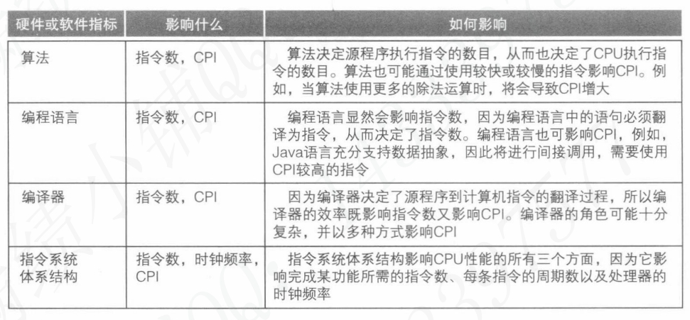
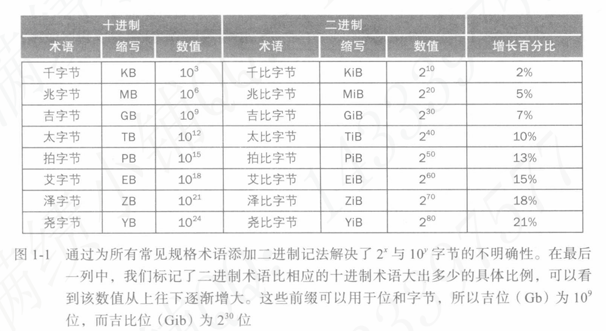
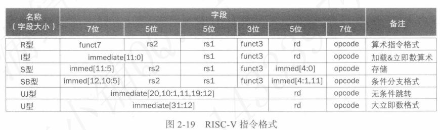
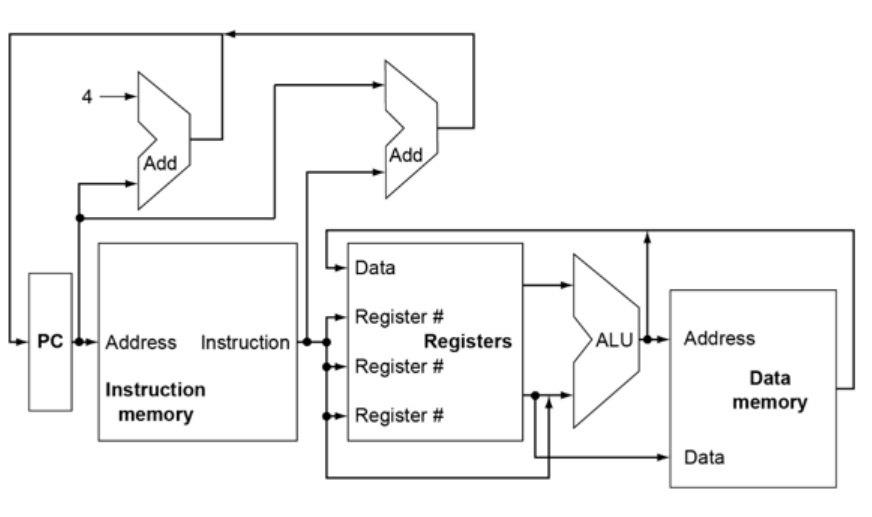
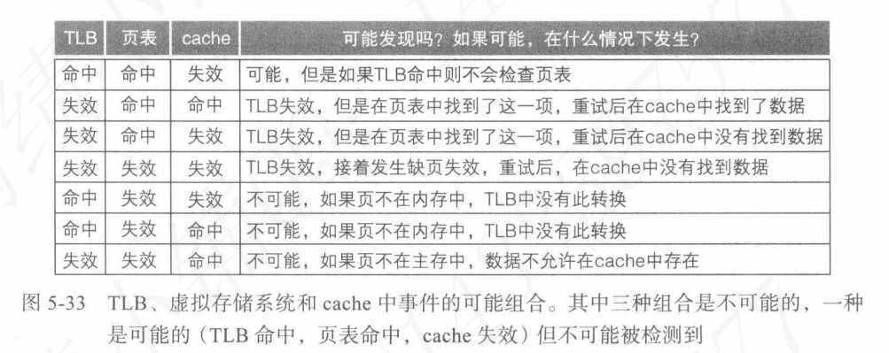

# COAD AUX MEM

# 这是Arielle上计组期间写的笔记喵！

# 对你有帮助的话记得点个Star喵！

（但是不建议像以前的我这样花这么多时间写这种笔记，其实效率不高喵！）

# 1.计算机基本概念

$$
计算机\\=硬件+软件\\
=硬件+程序+数据\\
=硬件+指令序列+数据
$$

$$
硬件\\=主机+输入输出设备\\
=CPU+存储器+输入设备+输出设备\\
=数据通路+控制器+存储器+输入设备+
输出设备\\
=运算器+寄存器+缓存+控制器+存储器+
输入设备+输出设备
$$

- <font color='#f35336'>Von Neumann体系结构包含的五大部件</font>：数据通路，控制器，存储器，输入设备，输出设备。
- <font color='#f35336'>应用软件</font>：依赖于系统软件。
- <font color='#f35336'>系统软件</font>：依赖于硬件。
- <font color='#f35336'>系统软件的组成</font>：主要包含操作系统和编译器。
- <font color='#f35336'>汇编程序</font>：将汇编代码翻译为机器代码。
- <font color='#f35336'>编译器</font>：将高级程序语言代码转化为汇编代码。
- <font color='#f35336'>集成电路（芯片）</font>：构成中央处理单元CPU。
- <font color='#f35336'>处理器的主要部件</font>：数据通路和控制器。
- <font color='#f35336'>数据通路</font>：负责完成算数运算。
- <font color='#f35336'>控制器</font>：负责指示计算机的其他组件在何时执行何种指令。
- <font color='#f35336'>内存</font>：由DRAM（动态随机访问存储器）组成，是易失性存储器，访问时间开销与存储位置无关。
- <font color='#f35336'>高速缓存（Cache Memory）</font>：处理器内部使用的存储器，由SRAM（静态随机访问存储器）构成。
- <font color='#f35336'>指令</font>：指的是计算机可以执行的行为。
- <font color='#f35336'>指令系统体系结构（ISA）</font>：硬件与底层软件之间的接口系统。
- <font color='#f35336'>基本指令系统和操作系统接口</font>：合称为应用二进制接口（ABI）。
- <font color='#f35336'>易失性存储</font>：称为计算机的主要存储。
- <font color='#f35336'>非易失性存储</font>：称为计算机的辅助存储。

## 性能评估

- <font color='#f35336'>（响应时间/执行时间）</font>：计算机完成一项任务所需的总时间，包含了所有步骤时间开销的总和。
- <font color='#f35336'>（吞吐率/带宽）</font>：在给定时间内计算机完成的任务数量。
- <font color='#f35336'>（挂钟/响应/运行）时间</font>：对时间的最直观定义，面向用户而言。也称为<font color='#f35336'>用户CPU时间</font>。
- <font color='#f35336'>CPU（执行）时间</font>：指定任务被CPU处理的净时间，除去了挂起和IO等开销。也称为<font color='#f35336'>系统CPU时间</font>。

如果将性能基于响应时间定义：

- <font color='#f35336'>系统性能</font>：空载系统的响应时间。
- <font color='#f35336'>CPU性能</font>：用户CPU响应时间。
- <font color='#f35336'>时钟周期</font>：描述了计算机执行一次基本功能的时间长度最小单位。
- <font color='#f35336'>**CPI（指令平均时钟周期数）**</font>：描述执行每条指令所需的平均时钟周期数，该值随程序不同而发生变化。由于程序可以使用并行优化，CPI可以小于1。
- <font color='#f35336'>指令分布</font>：程序使用指令的类型和数量分布。

- 时钟周期：Clock Cycle，不依赖于物理时间定义，描述处理器的行为数量。
- 时钟频率：Clock Rate，单位为Hz，描述了每一秒内可以执行多少个时钟周期。

$$
\color{#f35336}CPU时间=\frac{指令数\times CPI}{时钟频率} (s)
$$
- <font color='#f35336'>晶体管</font>：**泛指一切以半导体材料为基础的单一元件**。
- <font color='#f35336'>MIPS(每秒百万条指令数)</font>：处理器每秒钟执行几百万条指令.该参数随程序,体系结构等因素变化.

一个<font color='#f35336'>CMOS（互补性金属氧化物半导体）</font>元件进行一次0-1状态转换需要花费的能量称为该元件的<font color='#f35336'>能耗</font>。
能耗乘以开关频率得到相对于秒而言的功耗，单位为W。
$$
能耗\varpropto \frac{1}{2}\times负载电容\times电压^2\\
功耗\varpropto \frac{1}{2}\times负载电容\times电压^2\times开关频率
$$
在以上公式中,<font color='#f35336'>负载电容</font>是连接到输出端口上的晶体管数量(即"扇出"值)和制造工艺的函数,本质上与导线和晶体管电容有关.<font color='#f35336'>工作负载</font>：运行在计算机上的一组程序集合.





### Amdahl定律

Amdahl定律是由计算机科学家Gene Amdahl在1967年提出的一个公式，用于描述在一个计算任务中，通过并行化来提高性能的潜在加速。它主要用于评估并行计算中的性能瓶颈。
Amdahl定律的公式为：

$\color{#f35336}S = \frac{1}{(1 - P) + \frac{P}{N}}$

其中：

- S 是加速比（Speedup），即原始执行时间与加速后的执行时间的比值。
- P 是可以并行化的任务部分的比例。
- N 是处理器的数量。

#### 理解

- **串行部分 (1 - P)**：任务中不能并行处理的部分，这部分无论增加多少处理器都无法加速。
- **并行部分 (P)**：任务中可以并行处理的部分，可以通过增加处理器数量来加速。

假设某个计算任务中80%（即 P=0。8P = 0。8P=0。8）可以并行处理，20%（即 1−P=0。21 - P = 0。21−P=0。2）必须串行处理。如果我们使用4个处理器（即N=4），根据Amdahl定律：

$\color{#f35336}S = \frac{1}{(1 - 0.8) + \frac{0.8}{4}} = \frac{1}{0.2 + 0.2} = \frac{1}{0.4} = 2.5$

即使用4个处理器时，理论上的最大加速比是2.5倍。

Amdahl定律揭示了并行化的限制，即即使任务中的并行部分比例很高，但串行部分的存在会限制整体性能的提高。随着处理器数量的增加，加速比的增长会逐渐减小，最终趋于一个上限。

# 2.指令系统

## 基本概念

- <font color='#f35336'>指令</font>：控制计算机完成一些基本操作的命令
- <font color='#f35336'>机器指令</font>：0、1 形式的指令
- <font color='#f35336'>汇编指令</font>：文字符号形式的指令
- <font color='#f35336'>指令系统</font>：所有指令的集合。<font color='#f35336'>RISC-V(精简指令集计算机-第五版,Reduced Instruction-Set Computer-Five)</font>就是一种指令系统。
- <font color='#f35336'>机器语言</font>：所有机器指令的集合，指令的数字表述。是硬件层面指令的表示形式。
- <font color='#f35336'>汇编语言</font>：所有汇编指令的集合。
- <font color='#f35336'>TFLOPS</font>：每秒万亿次浮点运算。
- **<font color='#f35336'>基本块</font>**：不包含分支的指令序列。
- **<font color='#f35336'>叶子过程</font>**：不调用其他过程的过程。其状态不需要被保存。
- <font color='#f35336'>堆</font>：位于内存中，主要存储性质如链表，数组等动态数据的数据结构。其增长方向与栈相反。
- <font color='#f35336'>小端法</font>(little endian)：最低有效字节排列在多字节对象存储结构的最前端（55 22 00 00）。
- <font color='#f35336'>大端法</font>(big endian)：反之,最低有效字节排列在多字节对象存储结构的最后端（00 00 22 55）。
- 偏移表示法：一种二进制位层面上使用偏置量的表示法，以全0表示最小负数，全1为最大正数。

32 bits数据称为 <font color='#f35336'>**字**</font> ，64 bits称为 <font color='#f35336'>**双字**</font> ，16 bits称为 <font color='#f35336'>**半字**</font> 。
<font color='#f35336'>**RISC-V采用小端法**</font>表示地址。并且按照数学上对位进行编号的习惯将**<font color='#f35336'>最高有效位（右端）</font>**至**<font color='#f35336'>最低有效位（左端）</font>**依次编号为0~31，区间表示为[31:0]。

计算机的最小寻址间隔是1个字节（Byte）而不是更细化的位（Bits）。

几乎所有的指令系统体系结构都是按照单个字节寻址。1个字节=8个位。字的地址与字内的4个字节（1个字=32位=4*8位=4字节）其中的1个字节是相互匹配的，这也就意味着相邻的两个字的地址在数值表示上相差的量为4。


## 基本指令集规范

在以下指令列表中，可以认为**多操作数指令**均会将“**可读写的操作对象寄存器（即<font color='#f35336'>目的操作数寄存器</font>）”名称**放置到第一个操作数的位置。第二个操作数寄存器通常是只读的，称为<font color='#f35336'>**源操作数寄存器**</font>。指令中的两个源操作数寄存器，从左到右依次编号，左边一个是<font color='#f35336'>**rs1**</font>，右边一个是<font color='#f35336'>**rs2**</font>。


PC（程序计数器)的指向即“**当前正在执行的指令的下一条指令**”的地址位置。

PC相对寻址方法一般用于处理靠近跳转起始地点（链接）的跳转，其目标地址计算方式为$\color{#f35336}Target\ Address = PC + immediate ×2$。
对于距离更远的跳转则需使用多个指令，并用寄存器存放跳转目标地址。

- （jal / jalr）指令：两个操作数意义上依次为（当前地址作为被记录的待返回地址的写记录位置，是一个寄存器单元，或称为“链接” / 跳转目标地址和当前PC的相对偏移量）。
- lbu指令：从内存中加载一个**字节（Byte）**并将其放在寄存器最右侧8个**位（bit）**。
- lb指令：将被加载的字节视为有符号数。
- lhu指令：加载一个半字（Half Word）并进行零填充。
- lh指令：视为有符号数并进行符号位填充。
- lui指令：加载大立即数指令。不仅是只设置高20位的，还会将低12位全部填充0。随后，低12位将通过addi指令补全。

## 寻址模式


## 指令格式类型




- opcode：指令基本操作类型的编号，指令格式通过Opcode的部分被识别
- rd：目的操作数寄存器
- funct3：细分操作码，用于区分具体的指令
- rs1：第一个源操作数寄存器
- rs2：第二个源操作数寄存器
- funct7：细分操作码，用于区分具体的指令

在以<font color='#f35336'>助记符形式</font>表示的指令中，rs1和rs2不一定是自左向右依次对应的。对于存储指令sd，其rs2为存储数据的寄存器，助记符中排在rs1的左侧（前方）。实际上可以理解为sd指令没有rs2，所谓的rs2应该叫做rd，但因为sw实际上并不修改该寄存器，规范上选择不将其称为“目的寄存器”。

移位指令使用的格式为I型指令格式（不支持对32位数移动超过31位）。


### **R型**

格式说明（Register Type）：

- R型指令是<font color='#f35336'>**完全寄存器操作**</font>的指令，使用两个源寄存器和一个目标寄存器。

- 格式：

  ```
  opcode | rd | funct3 | rs1 | rs2 | funct7
  ```

  - `opcode`：操作码，决定了具体操作类型。
  - `rd`：目标寄存器。
  - `funct3` 和 `funct7`：细分操作码，用于区分具体的指令。
  - `rs1` 和 `rs2`：两个源寄存器。

特点与引入动机：

- **特点**：R型指令使用纯寄存器操作，不涉及内存访问。典型的 R 型指令包括加法、减法、逻辑运算、位移操作等。
- **引入动机**：R 型指令格式简单且高效，允许对寄存器进行操作而不依赖于内存，便于快速执行基本的算术和逻辑操作。

### **I型**

格式说明：

- I型（Immediate Type）指令用于<font color='#f35336'>**立即数运算**</font>或<font color='#f35336'>**内存加载**</font>操作。

- 格式：

  ```
  opcode | rd | funct3 | rs1 | imm[11:0]
  ```

  - `opcode`：操作码，决定指令的类型。
  - `rd`：目标寄存器。
  - `funct3`：子操作码，区分具体指令。
  - `rs1`：源寄存器。
  - `imm[11:0]`：12 位立即数（sign-extended），可以是常数或内存地址的偏移量。

特点与引入动机：

- **特点**：I 型指令适用于立即数运算，如加上一个常数、内存加载操作（`load`），以及控制转移指令（如 `jalr`）。
- **引入动机**：I 型指令提供了灵活性，允许直接使用立即数参与运算，减少了对寄存器的依赖，同时可以处理加载内存地址等场景，简化了内存访问操作。

### **S型**

格式说明：

- S型（Store Type）指令用于<font color='#f35336'>**内存存储**</font>操作。

- 格式：

  ```
  opcode | imm[11:5] | funct3 | rs1 | rs2 | imm[4:0]
  ```

  - `opcode`：操作码。
  - `imm[11:5]` 和 `imm[4:0]`：组合为 12 位立即数，表示存储时的偏移量。
  - `funct3`：子操作码。
  - `rs1`：基地址寄存器。
  - `rs2`：源寄存器，包含要存储的数据。

特点与引入动机：

- **特点**：S 型指令用于将寄存器中的数据存储到内存中。立即数用于指定内存地址的偏移量，数据存储在 `rs1` 所指向的地址处。
- **引入动机**：将立即数拆分成两部分（`imm[11:5]` 和 `imm[4:0]`），可以有效利用 32 位指令格式，同时允许对较大的内存地址进行存储操作。

### **B型**

格式说明：

- B型（Branch Type）指令用于<font color='#f35336'>**条件分支**</font>操作。

- 格式：

  ```
  opcode | imm[12] | imm[10:5] | funct3 | rs1 | rs2 | imm[4:1] | imm[11]
  ```

  - `opcode`：操作码。
  - `imm[12] | imm[10:5] | imm[4:1] | imm[11]`：组成一个 13 位的偏移量，用于计算分支的目标地址。
  - `funct3`：子操作码。
  - `rs1` 和 `rs2`：源寄存器，用于比较。

特点与引入动机：

- **特点**：B 型指令用于条件跳转，如等于、不同、大于等判断的跳转。立即数表示相对于当前指令的偏移量。
- **引入动机**：引入 B 型指令是为了实现灵活的条件跳转操作，特别是在程序控制流中的重要性。使用偏移量跳转可以减少跳转目标的编码位数，提高指令的密度。

### **U型**

格式说明：

- U型（Upper Immediate Type）指令用于<font color='#f35336'>**处理较大的立即数**</font>，通常是加载高位地址的立即数。

- 格式：

  ```
  opcode | rd | imm[31:12]
  ```

  - `opcode`：操作码。
  - `rd`：目标寄存器。
  - `imm[31:12]`：20 位立即数，填充到寄存器的高 20 位，低 12 位填充为 0。

特点与引入动机：

- **特点**：U 型指令用于高位加载操作，如 `LUI`（Load Upper Immediate），将 20 位立即数加载到寄存器的高 20 位。
- **引入动机**：U 型指令允许程序处理 32 位的立即数或地址，适用于内存管理、加载基地址等场景。通过加载高位和随后处理低位的方式，程序可以有效处理较大的数值。

### **UJ型**

格式说明：

- UJ（Unconditional Jump Type）型指令用于<font color='#f35336'>**无条件跳转**</font>操作。实际上相当于对U型指令的立即数排列做修改。

- 格式：

  ```
  opcode | rd | imm[20] | imm[10:1] | imm[11] | imm[19:12]
  ```

  - `opcode`：操作码。
  - `rd`：目标寄存器，用于存储跳转的返回地址。
  - `imm[20] | imm[10:1] | imm[11] | imm[19:12]`：组合成 21 位的偏移量，用于计算跳转的目标地址。

特点与引入动机：

- **特点**：UJ 型指令用于无条件跳转操作，如 `JAL`（Jump and Link），将当前的 PC 地址保存在目标寄存器中，并跳转到偏移量指定的目标地址。
- **引入动机**：UJ 型指令通过 21 位偏移量实现较大的跳转范围，适合用于函数调用或长距离跳转。同时，它还可以存储跳转后的返回地址，简化了函数调用和返回的实现。


---

## **寄存器**

- <font color='#f35336'>**临时寄存器**</font>：在调用过程中可以由 <font color='#f35336'>**被调用者**</font> <font color='#f35336'>覆写并不还原</font>的寄存器。
- <font color='#f35336'>**保存寄存器**</font>：在过程调用中必须由 <font color='#f35336'>**被调用者**</font> <font color='#f35336'>保存状态并在退出过程时安全还原</font>到原本状态的寄存器。
- <font color='#f35336'>**栈指针寄存器**</font>：指向栈顶元素的地址，并且指向的是该元素的首地址（起始字节地址）。
- <font color='#f35336'>**全局寄存器**</font>：x3，又名gp，是指向程序中的静态数据区的保存寄存器。
- <font color='#f35336'>**帧指针寄存器**</font>：也称为x8，指向的是一个栈帧的（第一个字的）起始地址，与x2（栈顶指针寄存器）共同确定了当前栈帧。


---

## 程序编译与链接


JAVA为提高可移植性被设计为依赖于软件的解释器，此解释器的指令系统也就是所谓的JAVA字节码。

存放数组的基址（起始地址）的寄存器在其存储该值时被称为基址寄存器（或称下标寄存器）。
将不常用的（或暂未使用的变量）暂时存储到内存的过程称为寄存器换出。

对于超过8个的参数，RISC-V约定将栈中额外的参数放在帧指针的“上方”并通过帧指针寻址。

| 文件类型   | 后缀名称（UNIX） | 后缀名称（MS-DOS） |
| ---------- | ---------------- | ------------------ |
| C源文件    | .c               | .c                 |
| 汇编文件   | .s               | .asm               |
| 目标文件   | .o               | .obj               |
| 静态链接库 | .a               | .lib               |
| 动态链接库 | .so              | .dll               |
| 可执行文件 | .out             | .exe               |


<center>上图展示了DLL的调用时链接过程<center>

## 多线程同步

RISC-V使用**<font color='#f35336'>条件存储字（sc.w）</font>**和**<font color='#f35336'>保留加载字（lr.w）</font>**实现原子操作。
原子操作要求一个操作的执行过程中不可能插入其他操作。

```assembly
again:  lr.w x10,(x20)
		sc.w x11,x23,(x20) 	// X11 = status
		bne x11,x0,again 	// branch if store failed
		addi x23,x10,0 		// X23 = loaded value
		// x11 -> Fail Indicator
		// x20 -> Mutex Memory
```

<center>以上汇编代码是原子交换操作</center>

```assembly
		addi x12,x0,1 		// copy locked value
again:  lr.w x10,(x20) 		// read lock
		bne x10,x0,again 	// check if it is 0 yet
		sc.w x11,x12,(x20)	// attempt to store
		bne x11,x0,again 	// branch if fails
Unlock:
		sd x0,0(x20) 		// free lock
```

<center>
    以上代码演示了经过条件分支指令优化的原子操作实现，同理可以用来实现其他功能的原子操作
</center>


### lr.w

- **格式**：`lr.w rd, (rs1)`
  - `rd`： 目标寄存器，用于存储从内存加载的值。
  - `rs1`： 源寄存器，包含要进行“加载保留”操作的内存地址。
- **作用**：
  - 从 `rs1` 指定的内存地址加载 32 位字到 `rd`。
  - 对该内存地址进行“保留”操作，表示处理器打算对该地址进行后续的写操作。
  - 如果 <font color='#f35336'>保留加载</font> 指令指定的内存位置，其<font color='#f35336'>**存储的内容**</font>在 <font color='#f35336'>条件存储</font> 指令执行开始（从而试图访问该地址）之前发生了变化，则条件存储指令失败，不会将值写入内存。

### sc.w

- **格式**：`sc.w rd, rs2, (rs1)`
  - `rd`： 目标寄存器，用于存储存储操作的结果（0 表示成功，非 0 表示失败）。
  - `rs2`： 源寄存器，包含要存储到内存的值。
  - `rs1`： 源寄存器，包含要进行存储操作的内存地址。其值和在其之前被执行的lr.w指令的第二个操作数`rs1`是一致的。
- **作用**：
  - 检查 `rs1` 指定的内存地址是否处于保留状态。
  - 如果处于保留状态，将 `rs2` 的值存储到该内存地址，并将 `rd` 设为 0（表示成功）。
  - 如果保留状态无效，存储失败，将 `rd` 设为非 0 值。继续执行，通常该指令下会有根据`rd`的值判断并跳转的条件分支指令，以确保在被互斥的情况下不发生竞争执行。

---

# 3.算数运算

## 进制转换

###  除 k 取余法

- **定义**：用于将一个**较高进制的数字**转换为**较低进制**（例如十进制转换为二进制等）。通过不断地用目标进制 k 进行除法，取余数得到数字的各个位。
- **步骤**：
  1. 取数字 N 除以目标进制 k，记录余数。
  2. 将商继续除以 k，直到商为 0，记录每次的余数。
  3. 余数按照**倒序排列**，即<font color='#f35336'>**最后一个余数**</font><font color='#f35336'>**第一个余数**</font>，依次作为转换后的数字<font color='#f35336'>**最高位**</font>到<font color='#f35336'>**最低位**</font>。

### 乘 k 取整法

- **定义**：用于将一个**较低进制的数字**转换为**较高进制**（例如二进制转换为十进制、十六进制等）。通过将每一位按位权相乘后相加，实现进制的提升。
- **步骤**：
  1. 从最低位到最高位，按位取出数字。
  2. 每一位乘以对应的进制权值（即 $k^n$，其中 $n$ 是该位所在的位置，从0开始）。
  3. 将所有位相加，得到最终的高进制数。

## 信息存储的基本知识

| 符号    | 类型 | 含义                     | 定义                                                         |
| ------- | ---- | ------------------------ | ------------------------------------------------------------ |
| B2T~w~  | 函数 | 二进制数转化至补码       | 位模式读取为补码有符号数                                     |
| B2U~w~  | 函数 | 二进制数转化至无符号数   | 位模式读取为无符号数                                         |
| U2B~w~  | 函数 | 无符号数转换为二进制数   | 无符号正整数值转换为无符号二进制码表示                       |
| U2T~w~  | 函数 | 无符号数转换为补码(读取) | 越界应激性的补偿反射                                         |
| T2B~w~  | 函数 | 补码转换为二进制表示     |                                                              |
| T2U~w~  | 函数 | 补码转换为无符号数表示   | 越界应激性的补偿反射                                         |
| TMin~w~ | 常数 | w位最小补码数            | 值为-2^w-1^，绝对值比TMax~w~大1。这是因为其不受到0的影响。其值举例为1111 1111。 |
| TMax~w~ | 常数 | w位最大补码数            | 值为2^w-1^-1，绝对值比TMin小1。这是因为其受到0的影响，有一个数字用于表示0。其值举例为0111 1111。 |
| UMax~w~ | 常数 | w位无符号数最大值        | 值为2^w-1，减去1是因为需要表示0。                            |
| +^t^~w~ | 运算 | 补码，w位加法            |                                                              |
| +^u^~w~ | 运算 | 无符号数表示，w位加法    |                                                              |

多字节对象被存储为连续的字节序列，<font color='#f35336'>对象的地址是其所使用的字节中最小的地址</font>。在内存的数字编号表示中，<font color='#00bc12'>单位1指的是一个byte而不是一个bit</font>。

16进制表示法下，字母的<font color='#f35336'>大小写不做区分</font>(A~F)。

在二进制表示状态下，进行标准二进制数(也就是无符号二进制数)向补码转换的规则如下：

- 正数最高位添加符号位0。
- 负数将其<font color='#f35336'>绝对值对应的正数原码</font>首先<font color='#f35336'>按位全部取反</font>，然后<font color='#f35336'>再加1</font>，最后<font color='#f35336'>在最高位处添加符号位1</font>。该转化方式可通过简单的加法推导得出。

<font color='#00bc12'>B</font>代表Binary，即<font color='#00bc12'>标准二进制数编码</font>。在以上的表格中，只有它表示二进制数字。T，U代表的均为各自规则下对应的数学数字。例如。TMax~w~代表的就是一个十进制数字。
<font color='#00bc12'>T</font>代表Two's_Complement，即<font color='#00bc12'>二进制下的补码表示数字所对应的数学数值</font>。
<font color='#00bc12'>反码</font>的英文为Ones' Complement。
原码的英文为Sign-Magnitude。

在补码中，补码数字的最高位为符号位。
从意义上理解其为1代表负数，为0代表正数。
从逻辑上理解其相当于是一个负权重位，权重值-2^w-1^。

位表示指的就是某个数学意义上的数字，在计算机中以码字表示的形式。

在不同的计算平台上，long和unsigned long可能随着系统位数变化而变化其字长。其他类型一般保持字长一致。

<font color='#00bc12'>MCB</font>指<font color='#00bc12'>最高有效字节</font>(Maximum Significant Byte)
<font color='#00bc12'>LCB</font>指<font color='#00bc12'>最低有效字节</font>(Least Significant Byte)

## 整数的类型转换

### 数学上的转换分析

形如(unsigned)x会将原本的数据x转换为unsigned int类型，在这种语法中也可以更换强制类型转换的目标类型。
这种转换仅仅更改读取方式，并未对数据的位模式做出任何改变。

如果要人为创建一个无符号数，需要在数字末尾添加修饰符`U`(不区分大小写)。

一个数字的位模式如果确定，则其在补码规则下读取，和在无符号规则下读取，相当于进行T2U~w~函数运算，其结果关系有：

- 当数字在补码下读取为正数，两种读取结果相同
- 当数字在补码下读取为负数，无符号数读取结果相当于补码读取结果加上2^w^获得的正数。

对以上的转换规则可以进行归纳，观察到<font color='#00bc12'>越界应激性的补偿反射</font>。即：

- 如果位模式对应的原本数学数值处于安全区间$\color{#f35336}[0，TMax_w]$，直接读取。
- 如果落于安全区间之外，则执行应激反应，加或者减2^w^使其落于目标读取模式可接受的有效数字区间内。

补码的名称来自于一项数学事实：对于一个n位2进制数A，A本身和A的二进制补码之和为2^n^。二者如果相加，结果作为无符号表示应为2^n^，恰好比n位二进制数可以表示的最大数字2^n^-1（该无符号最大数字在补码规则下被读取为-1）要大1，也就是一个全部位是1的数字再加1，这个和运算结果会因为溢出变为0。

因此，如果希望<font color='#f35336'>**将一个负数A转化为补码表示形式**</font>，可以先写出该数字的绝对值正数在补码下的表示x（此时x的原码和补码表示是一致的）后先全部按位取反（即无符号读取值从A变为2^n^-1-A，取反前后的数字和为全1的数，有符号读取为-1），再加上1（得到的无符号读取结果为2^n^-A）所得结果的无符号数读取值恰好和补码的定义对应的读取值相符。补码表示可以视为一种经过偏置的无符号数表示形式。

以下数学公式中，上划线表示按位取反，x即为A对应的绝对值正数。
$$
x+\overline{x}=-1,so\ that\ -x=\overline{x}+1
$$


### 语法上的转换分析

进行赋值时，隐式类型转化向被赋值者发生。
使用printf输出时可以指定读取方式。
有符号数和无符号数一起参与运算时，有符号数被转换为无符号数读取。

size_t类型实际上就是unsigned int类型。

## 符号位扩展和截断

### 扩展

无符号数字进行零扩展(指在最前面加0)
有符号数进行符号位扩展(指在最前面加符号位对应数字)

截断的时候均从最高位开始截断。

无符号数加法发生溢出的时候相当于进行取模运算，取模的对象值为2^w^。

#### 补充知识：移位运算

<font color='#00bc12'>向左</font>移位运算`<<`：所有数字向左移动K位，丢弃最高的k个数字，最右侧多出来的位用0填充。
<font color='#00bc12'>向右</font>移位运算`>>`：分为逻辑右移和算术右移。对于有符号数必定采用算术位移，对于无符号数必定采用逻辑位移。

- <font color='#00bc12'>逻辑右移</font>：在左端补上k个0。
- <font color='#00bc12'>算术右移</font>：在左端补上k个，与原数字的符号位数字一样的数字。

注意：移位运算的优先级低于加减法运算。如果不能准确把握实际的运算优先级，应该加上括号作为保险。

#### 截断

对于无符号数的截断，<font color='#00bc12'>截断到k位</font>直接进行<font color='#00bc12'>$\color{#f35336}x\ mod\ 2^k$运算</font>即可。

对于有符号(补码)数的截断，截断到k位的操作也完全一致。只是读取规则不一样。

## 整数运算

在数据变化中处理溢出的时候，一般的行为模式为<font color='#00bc12'>越界应激性取模运算</font>。

### 无符号数加法

无符号数均为正数，w位最多可表示2^w^个数字。当发生溢出时，将计算结果模2^w^，这一取模操作的逻辑实现就是舍弃最高位。
如果本来就没有进位，膨胀出的最高位为0，删除不会有影响。如果有进位则删除最高位的1就相当于完成取模。

(原理)溢出判定法：溢出后获得的值小于两个操作数中的任意一个。
(推导)略。

### 无符号数求反(无符号数的非)

定义无符号数的求反运算为求其无符号逆元：$\color{#f35336}-^u_wx=\begin{cases}x,x=0\\2^w-x,x>0\end{cases}$
<font color='#00bc12'>逆元</font>的意义是：使得一个数与其对应的逆元相加后，在某个指定的运算规则下获得结果0。

注意到，无符号数的非就是自身相对于最大表示数值的互补数，仅有最小值由于互补数超出表示范围而回归自身。

### 补码加法

如果发生溢出，进行越界应激性取模运算。正溢出则减去2^w^，负溢出加上2^w^。

(原理)<font color='#00bc12'>溢出判定法</font>：如果两个操作数同号，但结果是相反的正负号，则发生溢出。

### 补码求反(补码的非)

$\color{#f35336}-^t_wx=\begin{cases}TMin_w,x=TMin_w\\2^w-x,x>TMin_w\end{cases}$

注意到，补码的非就是取自身的数学相反数，仅有最小值由于自身的相反数超出表示范围而回归自身。

### 无符号数乘法

$\color{#f35336}x\ast^u_wy=(x\cdot y)mod \ 2^w$，先相乘后取模以处理溢出。

### 补码乘法

通过简单的**数学取模推导**，可以发现： 二进制编码相同的，字长为w位的两个数，无论是作为补码被读取为数学数值，还是作为无符号二进制编码被读取为数学数值，通过将它们各自在对应的十进制数学数值下进行乘法运算获得结果，然后再将结果转换回各自编码规则下的二进制表示后，尽管完整的二进制编码并不相同，但是根据计算机存储机制截断后获得的二进制码都是相同的。

在以上的计算过程中，需要注意数字被视为本质上具有无限个位，因此需要对补码数的高位进行符号扩展。

概括而言：无符号数-补码数在固定字长下的乘法运算位模式等价。

因此，实际上可以认为，将一个补码数值截断至w位相当于先计算该补码值模2^w^的结果，然后再将该结果进行U2T~w~读取方式转换。也就是相当于进行足够多次的越界应激性的补偿反射，直到结果落于正确的区间。

### 乘以常数

对于无符号整数表示，左移k位相当于执行一次与2^k^的乘法。即$\color{#f35336}x << k=x\ast^u_w2^k$。
对于补码表示的有符号整数，由于上文已经提及了补码和无符号数的位模式等价性，故同样有$\color{#f35336}x << k=x\ast^t_w2^k$。

因此，可以对任意常数的乘法进行优化，根据常数的二进制编码表示(无符号或补码)，将常数拆分为多个2的幂的和，进而将乘法改写为多个移位操作结果的加法和。

### 除以常数

数学符号$\color{#f35336}\lceil x\rceil$$\color{#f35336}\lfloor x\rfloor$依次表示向上取整和向下取整。

无符号数执行逻辑右移，有符号数执行算数右移以进行2^k^除法。在此操作方法下，补码的除法如果不能整除则总是选择向下取整。(这是由于整数的截断行为恰好去除了一部分具有正权重的位)。
如果希望补码选择向上取整(向上舍入)，则进行偏置操作(Biasing)。数学原理为：
$\color{#f35336}(x+(1<<k))>>k=(x+2^k-1)>>k$
以上行为的实质是在右移产生的所有临时小数点位上均+1以强制进位。

- 算数逻辑单元（ALU）：执行运算的硬件实现结构。
- 被乘数：乘法中的第一个操作数。
- 被除数：除法中的第一个操作数。
- 乘数：乘法中的第二个操作数。
- 除数：除法中的第二个操作数。


上述针对商的除法实现中，之所以需要将减法循环体重复的次数定为2^n^+1次是因为出于对齐需要，第一次的减法尝试会试图将<font color='#f35336'>**除数**</font>和**<font color='#f35336'>被除数</font>**均视为128位处理，其中除数最初位于128位的高64位，而被除数最初位于128位的低64位。第一次减法尝试没有进行位移（或者说位移量是0），操作相当于是无效的。

如果**有符号除法中**，<font color='#f35336'>**除数**</font>和<font color='#f35336'>**被除数**</font>的符号不一致，则（为了确保除法符号$\div$相对于负号$-$满足结合律）要求：

- **<font color='#f35336'>被除数</font>**和**<font color='#f35336'>余数</font>**持有相同的正负号。
- 同时只要<font color='#f35336'>**除数**</font>和**<font color='#f35336'>被除数</font>**的符号是不一致的，则**<font color='#f35336'>商</font>**的符号为负数，否则要求<font color='#f35336'>**商**</font>的符号必须是正数。


## 浮点算数


- **规格化**：将单一数值形式的数字表示转化为（类似科学计数法的）$规格化数\times m^{n}$形式。
- **规格化数**：在科学计数法的语境下，指左侧（非指数部分的）没有前导零的小数部分。
- **移码表示法**：也就是CSAPP中的偏置量法，其目的是使得在对（正/负）指数字段进行大小比较时可以安全利用无符号整数比较指令以及硬件。
  在此种表示手段下（以32位浮点数，8位指数位，指数表示范围$[-126,127]$为例）最大的正指数表示为全1，最小的负指数表示为全0。
  从无符号整数的角度来解读，指数字段所显示的值是实际指数值增加127的偏置量后的结果，如果想要从显示值读取实际值，则应该减去127偏置以获得结果。
- 将浮点数位模式显示值（规格化数时的情况）转化为数学意义真值的公式为：
  $$
  \color{#f35336}(-1)^s\times (1+尾数)\times 2^{(指数-偏移量)}
  $$
  


上图中，如果舍入操作导致了接连进位，结果重新变为非规格化值，则需要重新进行一次规格化步骤。


- **保护位**：保护位 (Guard Bit)是在进行浮点数运算时<font color='#f35336'>**最后一位有效数字之后的第1位**</font>。
  通过在舍入位的右侧增加一个保护位，防止在舍入时丢失精度信息。
  保护位为 1 可以指示需要进行舍入。

- **舍入位**：舍入位 (Round Bit) 是在进行浮点数运算时<font color='#f35336'>**最后一位有效数字之后的第2位**</font>。

- **粘滞位**

  - **定义**：粘滞位 (Sticky Bit) 用于记录在舍入中间结果（在最低有效位之右）是否有非零位出现。它的值为 1 表示<font color='#f35336'>**舍入位**</font>之后（如果以无限精度表示则）存在至少一个非零位。

  - **作用**：在进行舍入时，如果舍入位和保护位均为 0，但粘滞位为 1，结果仍然可以向上舍入。这样可以确保在某些情况下不会遗漏重要信息。
  	例如，当浮点数后续计算中出现非零位时，粘滞位能够提供关于这些信息的重要提示，有助于提高计算的准确性。


- **最后位置单位**

  - **定义**：最后位置单位 (ULP, Unit in the Last Place) 是指在浮点数表示中，当前数值的精度单位。它表示相邻两个可表示数之间的差值。

  - **作用**：ULP 用于量化浮点数计算的误差和精度，特别是在判断两个浮点数是否相等时，提供了更为准确的界定。
  	例如，若两个浮点数的差异小于或等于一个 ULP，则可以认为它们是“相等”的。
  	如果一个数被表示出的数值相比于真值，最低有效位小了 2 ，则可称少了 2 ulp 。


## 浮点数表示

数学表示的原理为$\color{#f35336}(-1)^SM\cdot 2^E$​
其中S(sign)为<font color='#00bc12'>符号位</font>，M(尾数，significand)为<font color='#00bc12'>尾数</font>，E(指数，exponent)为<font color='#00bc12'>阶码</font>。

- 尾数是一个二进制小数，其范围为$[1,2)$或$[0,1)$。

- 符号位决定数字正负。（对数值0的符号位解释经另外指定的规则处理）

- 在内存中，浮点数的存储顺序通常是符号位+阶码+尾数部分。

- 以下表格中，$e$指的是数学意义层面的数字实际指数值。而$e+bias$则是指数部分在机器存储中实际显示的值。

- 将浮点数位模式显示值（规格化数时的情况）转化为数学意义真值的公式为：
  $$
  \color{#f35336}(-1)^s\times (1+尾数)\times 2^{(指数-偏移量)}
  $$

### 表示范围

浮点数的设计机制使得其可以表<font color='#f35336'>**极大的(也就是阶码值很高，绝对值极大)**</font><font color='#f35336'>**极小的(也就是阶码值很小，绝对值极小)**</font>的值，代价则是<font color='#f35336'>**表示范围非常不连续**</font>。

以32bit浮点数表示为例(1符号位，8阶码位，23尾数位)，其所谓的"表示范围上下界"其实是关于上溢出的讨论，也就是度量其表示极大数字的能力。由于规格化与非规格化机制的存在，k位阶码实际上可以表示的指数范围为：
$$
\color{#bddd22}Exponent\in [2-2^{k-1},2^{k-1}-1]\\
Left\ Bound=1-Bias=1-(2^{k-1}-1)=\color{#bddd22}2-2^{k-1}\\
Right\ Bound=(2^{k}-1-1)-Bias=2^{k}-2-2^{k-1}+1=\color{#bddd22}2^{k-1}-1\\\\
For\ Example \ float\ 32bit\ (8bit\ Exp,2^7=128),\color{#bddd22}Exponent\in[-126,127]
$$
但是，指数部分的下界并不是对应浮点数类型的精确度下限。实际上由于非规格化表示机制的存在，可以通过在$\color{#f35336}Exponent=Left\ Bound$的前提下进一步通<font color='#f35336'>**将尾数部分的值大量置为0**  </font>来进一步逼近下溢出极限：
$$
\color{#bddd22}Exponent=Left\ Bound=2-2^{k-1}\\
(Switching \ to\ Subnormal\ Read\ Mode,Implied \ 0\ Expression)\\
(s=significand\ bits\ count)\\
Under\ Flow=2^{2-2^{k-1}}\cdot 2^{-s}=\color{#bddd22}2^{2-2^{k-1}-s}
$$


### 规格化的值

当<font color='#00bc12'>阶码</font>(指数的表示部分)的<font color='#00bc12'>位模式既不全为0，也不全为1时</font>，浮点数表示的值属于规格化的值。
对于以k个位表示的阶码，其应该被以经过偏置方式进行数学数值的解读。具体操作规则为：
$\color{#f35336}E=e-Bias,Bias=2^{(k-1)}-1$​​(注意该规则并不等同于补码的计算规则，而是变种无符号数)
其中，e也就是阶码二进制表示的，作为无符号数被解读出来的值。

引入偏置量的目的：允许表示小于1的浮点数，也就是允许表示的实际阶码值为负数。

<font color='#00bc12'>尾数</font>用于表示一个<font color='#00bc12'>个位一定是1的小数</font>，其中<font color='#00bc12'>尾数所表示的仅仅是小数点后的位模式</font>，个位是隐含1表示的。

### 非规格化的值

当<font color='#00bc12'>阶码(指数部分)全为0的时候</font>，阶码值是$\color{#f35336}E=1-Bias,Bias=2^{k-1}-1$（即阶码的Left Bound。<font color='#f35336'>**注意：此处阶码的数学真值是用$1$减去偏置量，而不是用阶码位模式对应的数学真值减去偏置量**</font>），对于<font color='#00bc12'>尾数则改为采用隐含0表示</font>。
此时非规格化值的存在意义是<font color='#00bc12'>表示0和非常接近0的数字</font>。
也就是说，此时阶码（作为一个负数）的数学真值对应的绝对值最大，使得指数部分产生最强的分数权重(即$1-2^{-(k-1)}$)。

对E的计算规则之所以要在$-Bias$的前面加上$1$，是为了使得<font color='#00bc12'>非规格化的浮点数阶码值</font>与<font color='#00bc12'>规格化值的最小阶码</font>相等。

### 特殊值

- **无穷**：当<font color='#00bc12'>阶码(指数部分)全为1</font>的时候，如果<font color='#00bc12'>尾数(小数域)全为0</font>，则浮点数表示<font color='#00bc12'>无穷</font>，正无穷或负无穷<font color='#00bc12'>取决于符号位</font>。
- **非数字（NaN）**：如果<font color='#00bc12'>尾数(小数域)不是全为0</font>，则结果均为<font color='#00bc12'>NaN(Not a Number)</font>。

## 浮点数舍入

有四种舍入方式：向0舍入（无条件抛弃损失部分，不做判断），向下舍入，向上舍入，<font color='#00bc12'>向偶数舍入</font>。
一般采用的手段均为向偶数舍入。

假设我们有一个浮点数的尾数部分需要舍入，这个数为：

```cpp
1.0110101101(二进制)
```

假设我们只保留5位有效位（即尾数的位数 + 1），那么我们需要对多余的位进行舍入。

1. **确定保留位数和多余位**：

  - 此处：保留位数为5，所以我们只考虑 `1.0110`，多余的位是 `101101`。

2. **检查第6位**：

  - 第6位是1，这说明我们需要进行舍入。

3. **检查第7位及后续位**：

  - 如果第6位是1并且后续位有非零，则向上舍入。
  - 如果第6位是1并且后续位全是0，则查看第5位（最后一位保留位）<font color='#f35336'>**此时准备进入向偶数舍入规则判断**</font>。

4. **向偶数舍入规则**：(注意到，仅仅在此种临界情况下才体现出"向偶数舍入"，一般情况均为"向邻近舍入")

  - 如果第5位是奇数（1），则向上舍入使其变为偶数。
  - 如果第5位是偶数（0），则舍弃多余位，保持偶数。

向偶数舍入，<font color='#00bc12'>使得最低有效位变为偶数</font>的意图：减弱舍入向大量数据中引入的统计偏差。
由于数学规律，向上舍入和向下舍入只有一种方式（在这个临界案例中）可以实现到偶数的舍入。

## 浮点数运算

$\color{#f35336}Round(x\bigodot y)$表示操作数$x，y$进行了$\bigodot$运算后的精确结果<font color='#00bc12'>进行舍入后的结果。</font>
对于所有的浮点数，其值一般都有逆元(也就是之间反转符号位)。例外是无穷和NaN。
$$
\color{#bddd22}(-\infin)+^f(+\infin)=NaN,NaN+^fx=NaN,任何与NaN进行运算的数都产生NaN
$$

### 浮点数加法

浮点数加法的实现方式为：对于两个浮点数F1，F2若阶码不同，则阶码较小的(不妨设F2的阶码较小)向阶码较大的对齐，F2的尾数(小数部分)因此变为一个处于$[0,1)$内的小数。随后将尾数部分相加即可。

满足交换律，单调性($\color{#f35336}a\geqslant b\Rightarrow a+c\geqslant a+b,c\neq NaN$)，不满足结合律(可能溢出)

### 浮点数乘法

即符号位，尾数分别相乘，阶码直接相加。
如果尾数相乘后大于2则对E进行修正。

满足交换律，单调性($\color{#f35336}a\geqslant b,c\geqslant 0\Rightarrow a*c\geqslant b*c\ \ \ a,b,c\neq NaN$)，不满足结合律，分配律(原因是可能发生溢出，或者因为舍入而失去精度)。同时也满足$\color{#f35336}a*^fa\geq 0$。

### 强制类型转换

| $int\to float$          | 浮点数绝对值表示范围极大，不可能溢出 | 浮点数表示精度是离散的，可能发生舍入 |
| ----------------------- | ------------------------------------ | ------------------------------------ |
| $(int/float)\to double$ | 表示范围加大，不可能溢出             | 表示精度更密集，不可能舍入           |
| $(double\to float)$     | 可能溢出为$(+\infin/-\infin)$        | 精度降低，可能舍入                   |
| $(float/double)\to int$ | 可能溢出。溢出处理结果不确定         | 无法表示小数位，向0舍入              |

# 4.处理器

RISC-V 指令系统的核心子集：

1. 存储访问指令：取字（ld）和存字（sd）
2. 算术逻辑指令：加法（add）、减法（sub）、与运算（and）、或运算（or）
3. 比较指令：小于则设置（slt）
4. 条件分支指令：相等则分支（beq）

## 基本术语和概念

- 单周期CPU：要求每个时钟周期执行完一条指令， 包括取指令；每条指令耗时一个周期。 
- 有效（asserted）：信号为逻辑高（而不是物理高所指的“绝对信号为1”）
- 无效：信号为逻辑低（而不是物理高所指的“绝对信号为0”）
- 总线：宽度为1以上的信号。
- <font color='#f35336'>**数据通路单元**</font>：一个用来（操作/保存）处理器内部的数据的单元。
  在此处讨论的RISC-V实现中，此概念包括了（指令存储器/数据存储器/寄存器堆/ALU/加法器）
- 控制器：根据指令的功能要求，负责产生相应的控制信号，用于取指令、数据传送、数据运算和流程控制等。
- 寄存器堆：32个通用寄存器所构成的结构。
- 数据通路：数据（包括指令、地址）从来源地到目的地沿途所经过的各个环节。
- CPU 数据通路：CPU 内部除控制器外的部分。
- 控制单元：（也称控制器、译码器）用来产生各指令在执行过程中所需要的各种**控制信号**，包括状态单元（寄存器和存储器）的**读写信号**，多路选择器的**选择信号**和运算器 **ALU 的操作控制信号**等。
- 硬布线控制：以指令中所包含的**操作信息**，及**寻址信息**为输入，主要利用逻辑电路产生完成指令功能所需要的各种有效控制信号，即控制单元主要是由逻辑电路构成的。

支持上述指令的单周期 CPU 基本结构如下图所示，其中包含多个**<font color='blue'>组合单元</font>**和**<font color='#f35336'>状态单元</font>**，主要有： PC、指令存储器、寄存器堆、ALU、数据存储器、 专用加法器、多路选择器、控制器。
其中，指令存储器和数据存储器不属于 CPU。

在以下的笔记区块中，所有边沿触发组件假定为上升沿触发。




## 数据通路

- 程序存储器：也叫指令存储器（IM，32 位地址，按字节编址），用来存放待执行的程序，即指令序列
- 程序计数器：（PC，32 位）用来为从程序存储器中取要执行的下一条指令提供地址。
- 加法器：（Adder，32 位）为顺序执行准备好下一条指令的地址。

### R型指令实现


为了实现R型（完全寄存器操作）指令，需要用到上图的寄存器堆和算数逻辑单元ALU。
寄存器堆提供四个输入端口：

- 读取目标寄存器编号输入端口1。（5位长）
- 读取目标寄存器编号输入端口2。（5位长）
- 写入目标寄存器编号输入端口1。（5位长）
- 写入数据内容输入端口1.

以及2个输出端口：

- 读取目标寄存器1所得数据内容输出端口。
- 读取目标寄存器2所得数据内容输出端口。

寄存器堆等状态单元的写操作是必须严格控制的，必须确保在指定的时间执行写操作。

### S型指令


为了实现存取指令需要使用上图的两个功能单元：一个**数据存储器**（DM，32 位地址，按字节编址，上下的MemWrite和MemRead是控制信号线，决定在时钟沿处是读取还是写入）和一个**立即数生成器**（将指令内部的12 位立即数读取为 32 位）。

下图中立即数生成器的输出之所以需要经过一个Shift Left 1通路是因为RISC-V按字节寻址，不可能使用到奇数地址。
<font color='#f35336'>**计算分支地址偏移量时，默认将偏移量左移一位**</font>（因偏移量以半字为单位）从而实现两倍于字面表示范围的数字大小范围。

### beq分支指令实现


为了实现beq分支指令，需要使用到上图的数据通路结构。

以上的R型实现没有详细探<font color='#f35336'>**不同运算所需ALU执行不同功能的问题**</font>如何解决，此处进行说明：其中ALU的操作模式通过**信号线**设置为减法模式，并通过其**输出中的零信号线**表明运算结果是否为0，该信号随即控制程序执行跳转<font color='#f35336'>**增量PC地址**</font>还<font color='#f35336'>**分支目标地址**</font>并重新设置PC。

特别地：

- 指令系统体系结构规定了计算分支目标地址时<font color='#f35336'>**基址是分支指令所在的地址**</font>。
- 计算分支地址偏移量时，默认将偏移量左移一位（因为偏移量以半字为单位）从而实现了两倍于字面表示范围的数字大小范围。

#### 控制单元与控制信号

控制单元可以由单 一译码器构成，也可以由多级译码器构成。
RISC-V 系统采用两级译码：<font color='#f35336'>**ALU 控制单元**</font>、<font color='#f35336'>**主控制单元**</font>。
之所以采用两级译码是因为，对于某些指令类型，生成 ALU operation 这一最终的 4 位控制信号不需要获得 funct 3 和 funct 7 字段。将这些可能性使用位宽更低的 ALUOp 进行编码可以简化电路结构。

RISC-V 指令中有两个字段和指令功能有关：opcode 字段和 funct 字段，其中 funct 可能又分成 2 部分。于是，首先可以根据 opcode 区分指令功能类型和格式，然后根据 funct 进一步区分具体指令。


ALU 控制单元的输入为：

- 用来区分是存取指令，还是 beq 指令，亦或是算术逻辑运算指令的 ALUOp 字段。由**主控制单元**产生。
- 指令的 funct 3 和 funct 7 字段。直接由指令提供。

ALU 以外的部件也有需要的控制信号，这些信号同样由主控单元生成，包括以下：

|          | 含义                   | 默认行为                            | 激活行为                            |
| -------- | ---------------------- | ----------------------------------- | ----------------------------------- |
| RegWrite | 写寄存器               | 寄存器堆不接受修改                  | 寄存器堆接收修改                    |
| ALUSrc   | ALU源操作数            | 选择rs2读取结果作为ALU输入          | 换成符号扩展结果                    |
| PCSrc    | 选择下一条指令         | 使用增量PC地址                      | 换成ALU计算输出的地址               |
| MemWrite | 写数据存储器           | 无效                                | 说明正在执行存储指令                |
| MemtoReg | 为寄存器修改选择数据源 | 使用ALU计算结果                     | 换成内存读取结果                    |
| MemRead  | 读数据存储器           | 无效                                | 说明正在执行内存读取指令            |
| Branch   | 指令类型可能引发分支   | 作为逻辑值与Zero信号计算出PCSrc的值 | 作为逻辑值与Zero信号计算出PCSrc的值 |


添加控制单元后的基本结构如下，其已经反映出了主控制单元和 ALU 控制单元的关系，并且使用Branch 控制信号取代了 PCSrc（用于实现beq分支指令）。

对于二路选择器，当其一位控制信号有效时，其输出对应于1路输入，否则对应于0路的输入。


## 数据通路操作

以下的图片展示了一些指令在整个数据通路中使用的数据线类型。每个指令使用了的数据通路以灰色线条进行标注。


## 流水线

- 吞吐率：单位时间内执行的指令数，即指令的执行速度
- 加速比：同一段代码单周期执行与流水执行所花费的时间之比，即流水执行与单周期执行的吞吐率之比。
- 操作周期：耗时最长的环节的时间开销，同时也是流水线 CPU 的时钟周期。
- 延迟：即流水线的阶段数

在流水线指令执行中，指令被分解为多个机器级步骤，流水线时钟周期的宽度与耗时最长的机器级步骤一致。
一条 RISC-V 指令的执行过程通常可以分成如下 5 道工序：

- IF：从指令存储器读取指令 
- ID：指令译码并读寄存器
- EX：计算数据或计算地址
- MEM：从数据存储器读取数据，或将数据写入数据存储器
- WB：将结果写入寄存器

在指令数量足够大（以致可以忽略启动阶段和终止阶段的成本）并且每个步骤需要的时间是（近乎）一致的，则流水线相比于单周期执行的加速比大小等于流水线的级数，也就是流水线处理的指令分成的步骤的数量。

RISC-V指令系统体系结构面向流水线而设计，这体现于：

- 所有指令长度对齐，允许在一个时钟周期内完成取指令操作。
- 更少且对齐的指令格式，允许解析指令和读寄存器操作在一个时钟周期完成。
- 存储器操作数（即访问内存的能力）由Load和Store指令独占，这一限制使得硬件只能在第三阶段（EX）计算地址，在第四阶段（MEM）访问内存。如果像x86一样允许很多指令访问内存，则第三和第四阶段增长为（地址计算阶段+存储器访问阶段+执行阶段）。

### 流水线冒险

#### 结构冒险

硬件结构不合理，或硬件资源配备不足导致指令不能在指定时间周期执行。

比如，如果采用单一存储器，则：取指令操作和存、取数据（内存访问指令的操作）就会有冲突，因为内存硬件资源不足，只提供单一端口。

#### 数据冒险

因为指令间干涉，无法及时提供正确的数据导致指令不能在指定时间周期执行。

- **流水线停顿**或**气泡**：因为数据冒险而使得流水线的并行操作停顿一个（或多个）时钟周期
- <font color='#f35336'>**（前递/旁路）**</font>：是一种解决此类冒险的方式。通过在硬件之间增加物理数据通路，使得其他指令可以从ALU等硬件的内部缓冲中获得执行所需数据，而不需要等待目标数据到达程序员可见的寄存器或内存区。
- RISC-V结构要求每条指令最多写一个结果，只能在最后一个执行阶段写结果，简化了前递所需的硬件设计，不需要一条指令前递多个结果。
- 需要注意：仅当目标阶段在时间序列上位于其所需数据生成的源阶段之前时，才能够通过（前递/旁路）减少延时。
- <font color='#f35336'>**载入-使用型数据冒险**（Load-Use Data Hazard）</font>：发生在一条指令的执行对位于其前方的指令存在依赖，且被依赖指令是在较晚阶段才产生结果数据的ld加载类指令的时候（例如add加法运算指令依赖于lw指令从内存取数据到寄存器的结果）的数据冒险。
- 前递<font color='#f35336'>**不能解决所有的数据冒险**</font>，这一特例即为<font color='#f35336'>**载入-使用型数据冒险**</font>。载入指令因为需要访问存储器，获得有效数据的硬件位置被延后了一个区块，即使前递也无法将数据送回到其下一个紧邻指令的EX阶段进行计算。
- 对于此类冒险，可以通过对代码进行重新排序，避免存在顺序依赖的指令紧密接触而减少数据冒险。

#### 控制冒险

控制冒险是<font color='#f35336'>**流程控制（分支和转移）指令在流水线中执行时可能导致的问题**</font>。需要转移时，无法及时获得下一条指令的地址（在最简单的解决方案下，直接插入气泡做等待，必须等待分支指令获得结果才能安全进行下一步）。

- <font color='#f35336'>**分支预测**</font>：一种在控制冒险情境下使用流水线的解决方案。在判断结果可获得前直接预测分支方向，并沿该方向执行。判断结果出现后，如果预测正确则继续，否则恢复状态并重新开始。
- <font color='#f35336'>**延迟决定**</font>：等待分支指令的执行结果。等待期间执行与分支无关的指令以确保硬件资源不会闲置。也称为延迟转移。仅适用于等待时长小的场景，否则仍然是使用分支预测。

### 流水线数据通路

为了实现流水线，需要同样对硬件功能进行分层分区。

流水线数据通路可以在单周期数据通路的基础上做适当的修改得到。RISC-V 系统采用 5 级流水线，依次对应指
令执行的 5 个阶段，每级负责一个阶段：IF、ID、EX、MEM、WB，数据流从左至右依次通过 5 级流水线，且在大部分情况下不会发生逆流（逆流则存在冒险）。


两个可以伴随数据逆流的例外：

- 写回阶段，可能会把结果写回数据通路中间的寄存器堆中。
- 更新 PC 时，需要在自增的 PC 和 MEM 级的分支地址间进行选择。

设计流水线需要考虑两个主要问题：

- 如果希望流水线同时处理多个指令，需要能够<font color='#f35336'>**同时持有多个指令的值**</font>，以及<font color='#f35336'>**其执行所涉及到的数据**</font>。
- 相邻的指令间的数据流问题及流程控制问题。

对于第一个问题，通过在流水线电路结构分成的5个层级中，每两个层级之间加入寄存器用于存储即将输入下一个层级的指令的寄存器。
这些寄存器的存在保证了<font color='#f35336'>指令本身不会在未执行完成时丢失</font>，以及可以存储中间处理结果（即后一级要用到的各种信息），这些中间结果包括：

- 前一级根据指令中的相关信息所做的各种处理的结果。
- 指令中余下的后续各级要用到的各种信息。

同时，流水线寄存器相当于也要求了所有的指令都必须更新处理器中的某些状态单元所记录的内容（状态）。
这也说明了为什么最后一个阶段（WB，写回阶段）之后没有安置流水线寄存器，即WB阶段本身即为写寄存器操作，其已经对寄存器这一状态单元进行了修改且其修改对程序员可见。如果有必要访问其输出的结果，直接操作寄存器堆即可。

由于每条指令都一定会修改PC计数器的值，PC可以看作是一个特别的流水线寄存器，它为流水线的IF（取指令）阶段提供数据。


上图展示了插入流水线寄存器后，流水线数据通路的结构。
每个流水线寄存器都会存储<font color='#f35336'>**所有与其接入的，前一个阶段输出的值**</font>，这是由于数据通路的局部不能追踪当前正在执行什么指令，需要保存对于任何类型的指令所有可能用到的中间值。
因此，<font color='#f35336'>**自增以前的PC初始值**</font>将也会被保存在IF/ID寄存器中，以供后续可能需要追踪初始地址的指令（如beq）使用。

## 流水线数据通路控制

### 流水线图示

流水线有2种图示手段：

- 单时钟周期流水线图：视觉上按照每个指令单独占用一个数据通路硬件，某一个时钟周期内相邻的多条指令的数据通路结构及其执行状态，并标识出所处的流水级不同。

	(一般会使用多个单周期流水线图进行描述）
- 多时钟周期流水线图：只画出一个数据通路，但是画出连续的多个时钟周期内，多条指令在此数据通路内的执行状态。
	
	以下的画法以硬件表示指令执行阶段：
	
	- IM（Instruction Memory）：指令存储器。（内存的程序区块）
	- Reg（Register）：寄存器堆。
	- DM（Data Memory）：数据存储器。（内存）<a name="多周期流水线图示"></a>
	
	
	

流水线数据通路中的每一个逻辑单元都只能在一个流水级中使用，否则会产生结构冒险。所以，这些单元及其控制可以和相应的流水级相联系。

### 流水线控制信号

流水线数据通路并不改变控制信号的含义，其在单周期数据通路上增加模块而获得， 可以使用与简单数据通路相同的控制信号。


（流水线寄存器/PC程序计数器）均没有单独的写入信号，它们在每个时钟周期被写入。

### 指令工作周期细分

#### IF取指令阶段

- IF（Instruction Fetch）取指令阶段：
	
	时钟周期内主要行为：

	- 根据PC的当前值读取指令存储器
	- 将读取到的指令存储到IF/ID流水线寄存器内部（如前文所述，为了部分需要用到PC的指令，而存储了PC值）
	

	周期任务结束时：

	- 已经向流水线寄存器存储PC的当前值。

	- PC（根据后面的阶段发回的控制信号）写入新的值。
	
	此阶段没有控制线。

#### ID指令译码-读寄存器阶段

- ID（Instruction Decode）指令译码-读寄存器阶段：

  特征解释：

  - 如图4-44所示，为了对数据通路的多计算功能ALU进行操作，需要使用ALU控制信号线，而其中的控制信号码则需要ALU控制单元产生。

  - 如图4-45所示，ALU控制单元的决策依赖于[控制单元](####控制单元)一节中所提到的主控制单元（在ID阶段）生成的ALUop信号和由指令直接提供的自身类型与操作码信息。在流水线中，不能简单地从指令存储区读取指令，需要从上一流水线寄存器中获取。因此，为了在EX阶段可以使用ALU，需要将指令的部分字段直接接到下一流水线寄存器。

  时钟周期内主要行为：

  - 将指令的不同字段输入不同的硬件接口（如寄存器堆，立即数生成器，或直接传递到下一流水线寄存器）
  - 对指令内（如果存在）的立即数的符号扩展与转移存储（转移到了流水线寄存器内）。
  - 根据指令的寄存器操作数完成对寄存器的数据访问（可以理解为用寄存器中的实际数据替代了指令中对寄存器的引用）
  - 主控制单元根据指令内容直接获得以后所有阶段会用到的控制信号值，传递给ID/EX流水线寄存器。

  周期任务结束时：

  - 主控制单元生成的控制信号被存入ID/EX流水线寄存器。
  - （本阶段没有用到的来自上一流水线寄存器的）PC计数器历史值被存入ID/EX流水线寄存器。
  - 读取寄存器堆获得的寄存器内数据被存入ID/EX流水线寄存器。
  - 指令内立即数被存入ID/EX流水线寄存器。
  - 指令的功能字段位被直接存入ID/EX流水线寄存器。
  - 指令的写入目标寄存器（如果有）字段rd（为了可能将会向寄存器堆写回结果的指令而）被直接存入ID/EX流水线寄存器。

  此阶段没有控制线。

#### EX执行-地址计算阶段

- EX（Execution）执行-地址计算阶段：

	时钟周期内主要行为：

	- 根据指令在ID阶段已获得的数据，以及指令本身的类型数据等，选择（Mux多选器应该选择读取哪些数据输入ALU/ALU应该对输入其中的数据做何种运算），此工作由EX硬件区的ALU控制单元完成。
	- ALU获得经过选择后的数据输入，完成数据计算，获得结果，跳转地址（如果有），零信号线信息。
	- 结果和一部分未使用数据传递到下一流水线寄存器。

	周期任务结束时：

	- 数据计算结果被存入EX/MEM流水线寄存器。
	- 跳转地址（如果有）被存入EX/MEM流水线寄存器。
	- 零信号线状态被存入EX/MEM流水线寄存器。
	- 来自上一级流水线寄存器的，目标寄存器操作数字段rd被直接存入EX/MEM流水线寄存器。
	- 来自上一级流水线寄存器的，指令的第二寄存器操作数在ID阶段的读出寄存器内数据结果（为了可能的向内存写入寄存器内数据的存储指令）被直接存入EX/MEM流水线寄存器。
	- 没有使用到的控制信号被直接存入EX/MEM流水线寄存器。

	此阶段涉及到控制线ALUop和ALUSrc。

#### MEM存储器访问阶段

- MEM（Memory Access）存储器访问阶段：

	时钟周期内主要行为：

	- 根据（主控制单元生成的Branch信号值和ALU运算的零信号线结果）生成PCSrc跳转决策信号。
	- （由MemWrite信号表明，如果指令为存储指令才）将ALU运算结果视为内存地址，将EX/MEM中的第二寄存器读取数据写入指定内存地址。
	- （由MemRead信号表明，如果指令为加载指令才）将ALU运算结果视为内存地址，从内存中读出一项数据。
	- （不管指令是不是涉及存储和加载都）将ALU运算结果传入下一级以供非（存储/加载）指令使用。

	周期任务结束时：

	- 从内存中读出的数据（如果有）被存入MEM/WB流水线寄存器。
	- 来自上一级流水线寄存器的，ALU运算结果被无条件地存入MEM/WB流水线寄存器。
	- 来自上一级流水线寄存器的，没有使用的目标寄存器操作数字段rd被直接存入EX/MEM流水线寄存器。
	- 没有使用的控制信号被直接存入MEM/WB流水线寄存器。

	此阶段涉及到控制线Branch，MemRead和MemWrite。

#### WB写回阶段

- WB写回阶段：

	时钟周期内主要行为：

	- （根据上一流水线寄存器提供的RegWrite信号表明是否需要写回，MemtoReg信号表明指令要向寄存器堆中写入的数据来自于寄存器读取值还是内存读取值）选择一路合适的数据并（如果需要则）执行寄存器写回。

	周期任务结束时：

	- 寄存器堆状态修改，指令执行结束。

	此阶段涉及到控制线MemtoReg和RegWrite。
	其中MemtoReg会引发数据的逆向流动。

需要注意：以上的流水线寄存器存储内容还没有考虑处理**冒险**时，需要额外保存的数据。


## 流水线数据冒险处理

### 前递

前递方法适合解决数据冒险类型。

在流水线中，对寄存器的一次读或者一次写不会花费一整个时钟周期。为了在寄存器在同一个周期内即被写入又被读取时可以正确地给出最新存储值，硬件层面约定写入在前半个周期发生，读取在后半个周期发生。

#### 数据冒险检测

出于分析数据冒险的便利，给出对流水线寄存器（作为一个超高长度寄存器）的字段命名规则，将流水线寄存器当作一个类对象，而每个字段均为其数据成员，使用C++点号访问法。


在此基础上，数据冒险的发生需要四个条件的任意一个成立：

- 1a条件：`EX/MEM.RegisterRd=ID/EX.RegisterRs1`（且`EX/MEM.RegisterRd != 0`）
	即<font color='#f35336'>**“一条指令在EX（执行计算）阶段试图使用的源寄存器数据所来自的寄存器”**</font>恰好是<font color='#f35336'>**“另一条指令在MEM阶段开始执行时（被检测到）试图写入数据的目的寄存器”**</font>，同时该寄存器不是x0。
- 1b条件：`EX/MEM.RegisterRd=ID/EX.RegisterRs2`（且`EX/MEM.RegisterRd != 0`）
	同上。
- 2a条件：`MEM/WB.RegisterRd=ID/EX.RegisterRs1`（且`MEM/WB.RegisterRd != 0`）
	即<font color='#f35336'>**“一条指令在EX（执行计算）阶段试图使用的源寄存器数据所来自的寄存器”**</font>恰好是<font color='#f35336'>**“另一条指令在WB阶段开始执行时（被检测到）试图写入数据的目的寄存器”**</font>，同时该寄存器不是x0。
- 2b条件：`MEM/WB.RegisterRd=ID/EX.RegisterRs2`（且`MEM/WB.RegisterRd != 0`）
	同上。

以上的（1a/1b）类冒险称为EX冒险，而（2a/2b）类冒险称为MEM冒险。

对其进行一些解释：

- 在实际的硬件中，每个时钟周期内，可以观测的流水线执行状态不是形如[图4-41](#多周期流水线图示)的时间-指令序列二维平面，而是仅仅存储了4个流水线寄存器当前状态的硬件按时间切片的结果，即单周期流水线图示。
- 为了在每个周期监控是否有冒险发生，需要访问4个流水线寄存器的当前状态下存储的，有关于指令涉及寄存器的信息。每个流水线寄存器都代表了一条正在执行的不同的指令。
- 由于前递的信息，其接收对象是EX硬件区而不是ID区的寄存器堆（前递到寄存器堆的设计是不合适的，因为数据在EX区时接触到ALU才会被使用，所以前递应该直达目标），选择（从当前的状态寄存器中读取的有可能因为数据冒险而实际上过时的错误数据/从前递单元读取的数据）以供ALU使用，这一决策的任务硬件位于EX区。
- 因此，一个指令如果和执行顺序位于其前的指令发生了数据冒险（向前数据依赖），该冒险最早在EX阶段才能被检出。检出方法即比较当前状态下各个流水线寄存器中的字段值。
- 在引发向前依赖的后方指令位于EX阶段时，前方指令可能执行到了MEM阶段启动（对应指令数据位于EX/MEM）或者WB阶段启动（对应数据位于MEM/WB），因此有了上述的四种冒险条件。
- 上述四种条件对应的情况都可被概括为<font color='#f35336'>**”一条后执行指令在EX阶段被流水线发现需要使用一个寄存器数据，而该寄存器数据即将但还尚未被先执行指令修改“**</font>。

在以下的讨论中，只需要考虑将事件序列前方的指令EX阶段产生的（在当前正处于对应阶段的流水线寄存器中的）数据向前传递，解决后方指令向前依赖的问题。
于是要被前递的数据可能是ALU或跳转地址计算器的计算结果。

- 不是所有的指令都会在<font color='#f35336'>**出现寄存器操作数冲突的时候**</font>将结果写回寄存器（例如目标寄存器为x0以实现数据丢弃），因此需要检测RegWrite信号的有效性。对于具有目的寄存器的指令（如ld，add等），如果其目的寄存器为x0，则RegWrite信号为0。


#### 前递实现

希望进行前递，即希望在后执行指令的EX阶段<font color='#f35336'>**从任何流水线寄存器而不仅是寄存器堆中获得所需的数据**</font>，即仅仅从前邻的ID/EX中获得。

##### 条件判断

无论是否需要前递，数据的读取和传递都会进行（即使数据可能因为冒险问题而实际不可用，或前递数据因没有发生冒险而没有意义）。实际前递的终点是正在执行的指令所处的EX硬件区，起点则是已经经过EX区的前执行指令。

是否进行前递的决策，其执行过程通过Mux选择接收哪一路数据而实现，其制定过程通过一个前递控制单元实现。该单元的信号码信息如下。


该单元为了判断是否存在冒险，需要从流水线寄存器中读取（当前位于EX阶段的）指令的两个寄存器操作数。因此加入前递后ID/EX需要额外预留接口接收指令的rs1和rs2字段。

添加了前递机制后的流水线图如下。


上图为两种冒险在硬件信号层面的判断条件。

##### 特殊冒险

判定条件修正：

- 在例如数据多样本求和的指令序列中，有可能出现同一寄存器在连续多个指令中频繁出现的情景，这可能会导致EX和MEM冒险判定条件同时被满足。
- 当前位于EX阶段的指令，其前邻第1条指令（当前执行阶段为MEM，寄存器EX/MEM）在这种情况下，和前邻第2条指令的目的操作数寄存器是一致的，且均与当前位于EX的指令产生冒险。
- 由于逻辑上的先后关系，前邻第2条指令相比于前邻第1条指令的数据是过时的。因此，给出的MEM冒险判定条件中额外限制了EX冒险此时不存在。

WB阶段的前递：

- WB阶段无冒险，这是因为寄存器堆的读取和写入可以在一个周期内同时完成且读出最新数据。这相当一个寄存器堆提供的前递。

载入-使用型数据冒险：

- **sd**紧跟在**ld**指令之后而造成的**载入-使用型数据冒险**是此类冒险中，一种可以用前递解决的特例，**ld**产生数据较晚，而sd使用数据也较晚。当载入-使用型数据冒险造成了冒险时，可以在EX/MEM和MEM/WB之间加入前递硬件支持。
- 例如，在复制操作中，可能需要先**ld**再**sd**。**ld**的目标寄存器rd和**sd**的其中一个源寄存器rs2是一致的。在不使用前递的情况下，**sd**应该在ID指令解码-读寄存器阶段阻塞，并等待**ld**指令完成WB阶段的写回操作才能从寄存器中读出正确的值。
- 如果使用前递，则控制单元应该检查出（此处发生了**载入-使用型数据冒险**/由于指令需要访问内存获得操作的数据值，不能简单地将ALU计算结果前递），从而允许**ld**指令的WB阶段开始执行（**ld**数据位于MEM/WB中）时将其中的待存储结果前递到刚刚开始执行MEM阶段的sd指令，覆盖其读取的无效寄存器值。


### 停顿

停顿旨在解决由ld加载类指令引起的（不能由前递解决的）<font color='#f35336'>**载入-使用型数据冒险**</font>，以及beq类分支指令引起的**控制冒险**。

#### 载入-使用型数据冒险

问题描述：

- 在不引入指令顺序调整的时候，解决此类冒险需要依赖一个进行冒险检测并插入空指令（即停顿）的控制单元。
- 当以下 2 个条件同时成立时需要停顿：
	- 指令是ld类加载指令（唯一需要读内存的指令）。
		<font color='#f35336'>信号线表示为ID/EX.MemRead有效。</font>
	- 在EX阶段即将被执行的这一ld类加载指令，其目标寄存器与ID阶段即将解码-访问寄存器的指令指定的某个源操作数一致（即发生冲突）
		<font color='#f35336'>信号线表示为`(ID/EX.RegisterRd=IF/ID.RegisterRs1 or ID/EX.RegisterRd=IF/ID.RegisterRs2)`。</font>
- 该单元物理层面的数据输入源，是ID阶段流水线硬件的前后两个流水线寄存器，其通过信号线检测紧邻的两条指令是否引发了载入-使用型数据冒险。

问题解决：

- 为了在检测冒险后实现停顿，该控制单元需要同时禁止当前即将开始执行IF和ID阶段的指令继续向后步进。
- 进一步而言，需要禁止PC寄存器，IF/ID流水线寄存器发生状态改变。
- 为了阻止这两个寄存器发生状态改变，一方面需要为ID/EX流水线寄存器的信号接收路径加入一个Mux，由冒险检测单元控制路径选择。
  如果有冒险，将 0 这一数值覆盖ID/EX流水线寄存器中所有的7个控制信号位以阻止这一指令修改任何寄存器的值。
  这一写控制信号称为IF/IDWrite信号。
- 另一方面，为PC的写入引入一条使能线，由冒险检测单元控制。
  通过这条线的控制信号冒险检测单元在一个周期的时长内阻止PC修改自身。
  这一写控制信号称为PCWrite信号。
- 当前指令将因为RegWrite和MemWrite信号均为0而不能够修改处理器状态，其自EX阶段开始的，流水线后半部分执行的操作将会使用错误的数据，但其操作本身已经不再具有任何意义，成为空指令。PC在这个周期内也被锁定，以确保下个周期重复地取出该指令重新执行。
- 随后，流水线可以在本次冒险以后正常运行。完成上述功能的硬件结构示意图如下。


冒险检测单元对Mux的控制信号是没有名称的。
习惯上约定信号为 0 时时阻止写，为 1 时允许写。

数据冒险阻塞控制单元的输入：

- 当前指令要读的寄存器： IF/ID.Instruction.rs1、IF/ID.Instruction.rs2
- 上条指令的内存访问信号线： ID/EX.MemRead

#### 控制冒险

由于采用分支预测方法提升流水线速度，必须在分支预测出错时进行错误处理。

在上文的流水线硬件结构中，必须等到MEM阶段才能将branch信号和zero信号相与获得分支判断结果，此时已经有三个指令被读入流水线。

丢弃指令，需要将指令的控制信号值全部设置为 0 ，同时还应该注意需要设置的指令有3条（分别刚刚开始执行IF，ID和EX阶段）。

##### 缩短分支延迟

- 分支判断结果产生时间太晚，因此有必要将这一指令产生结果的计算硬件结构单独地向前移动，更快得到结果，以减少得出结果后被意外送入流水线而需要被清理的顺序指令的个数。
- 为了实现尽快决策，需要完成两个操作：<font color='#f35336'>**计算分支目标地址**</font>，<font color='#f35336'>**判断分支条件**</font>
- <font color='#f35336'>**提前计算分支地址**</font>：
	是相对简单的，IF/ID寄存器含有的立即数和PC值可以直接在ID阶段计算出目标地址。
	（为了简化控制，该计算在每个指令执行时都会被进行，但结果仅仅在指令为branch类型时有效）
- <font color='#f35336'>**判断分支条件**</font>：
  对于beq相等跳转指令，在得到 2 个比较对象的值后，异或后按位或缩减为 1 位后，即可完成判断计算。
  - 为了<font color='#f35336'>**得到上述的两个比较对象的值**</font>，需要加入向ID阶段进行前递的硬件和冒险检测机制，以免beq需要的值位于流水线寄存器而不是寄存器堆，或者甚至还未计算出来而必须停顿。
    - 当所需的值已经存在于流水线内，希望通过旁路前递到ID阶段的，beq所需要的源操作数，可以从EX/MEM或者MEM/WB中获得。
    - 当所需的值还未计算出来（例如在MEM阶段执行完后才产生结果的lw指令），需要进行停顿。

- 在以上修改之后，一次beq分支预测错误最多只会造成一条错误指令进入流水线，且跳转条件检验和PC修改完成时该指令位于IF阶段。需要对其进行清除。
- 于是在硬件上对IF/ID寄存器添加了IF.Flush控制线（ 1 有效），其有效的时候会将其中的指令字段设置为全0，使得该指令成为nop指令。

添加了额外前递单元和对beq指令作用的冒险判断单元后，流水线结构如下图：


- 以上对控制预测处理手段将会在每次分支预测错误的情况下，导致 3 个时钟周期空泡。（ID/IF/EX）硬件区即将开始执行的指令所位于的寄存器均会被进行信号置 0 操作。

##### 动态分支预测

当清理和恢复的成本过高的时候，需要使用动态预测机制。

查看指令中的地址，考虑以前该指令执行的时候，条件分支是否跳转，并以此做出决策。根据程序运行的实际情况，不断调整预测结果，从而提高处理器的效率。

- 分支预测缓存（Branch Prediction Buffer, BPB）

	定义：典型的 BPB 是，一块按照分支指令的地位地址进行（不准确）定位的小容量寄存器，记录了最近执行的分支指令及其走向（跳转或不跳转）。
	BPB 中的每一条记录由分支指令的地址和它的预测状态组成。

	结构：通常使用 2位饱和计数器（2-bit saturating counter） 来跟踪分支历史状态，而不是采用容易受到低频率预测失误情况影响的 1位计数器，这要求仅在发生两次错误时才更改预测倾向。
	

- 分支目标缓存（Branch Target Buffer, BTB）
	
	定义：
	
	分支目标缓存用于存储分支跳转目标的地址。与分支预测缓存不同，BTB 记录的是分支指令跳转的目标位置，而非预测状态。
	
	工作原理：
	
	如果在预测机制下，分支预测器告知需要跳转，由于分支预测器在ID即给出了预测结果，流水线需要再花费一个时钟周期进行地址计算。此处可使用BTB优化。
	
	当处理器遇到分支指令时，BTB 根据该分支指令的地址查找缓存中的跳转目标地址。
	
	如果找到目标地址，处理器可以直接跳转到该目标地址，从而减少流水线中的停顿，避免每次重新计算目标地址，从而加速分支目标的获取。
	
- 相关分支预测器（Correlating Branch Predictor）
	
	定义：
	
	相关分支预测器（或两层分支预测器）根据多个历史分支指令的走向，预测当前分支的走向。它考虑到不同分支间的相关性，而不仅仅是单个分支的历史行为。
	
	工作原理：
	
	相关分支预测器使用一个全局历史寄存器（Global History Register, GHR）来记录最近多个分支指令的行为。这些历史行为影响当前分支的预测结果。
	某些复杂的分支模式（如嵌套循环）在使用简单的分支预测时会较难预测，但相关预测器能够更好地捕捉这种模式。
	
- 锦标赛分支预测器（Tournament Branch Predictor）
	
	定义：
	
	锦标赛分支预测器是一种结合了多种预测器的机制，用来选择最佳的预测方案。不同的预测器针对不同类型的分支指令表现最佳，因此锦标赛分支预测器通过竞争来选择最优的预测结果。
	
	工作原理：
	
	锦标赛分支预测器同时运行多个预测器（如全局历史预测器和局部历史预测器），每个预测器负责不同的分支预测。
	使用一个选择逻辑（通常是基于历史性能）来选择哪个预测器提供的预测结果最可靠，并根据预测准确性更新选择逻辑。

### 例外和中断

- **例外**：也称中断（有时不区分），指打断程序正常执行的意外事件，如未定义指令等。例外可以来自处理器内部（如算术运算错误）或外部设备（如输入输出错误）。处理器会通过中断机制响应这些异常事件。
- **中断**：特指来自处理器外部的例外（有时不做区分）。中断是硬件或外部设备向处理器发出的信号，通常用于通知处理器某些事件的发生，如I/O操作完成、定时器到期等。
- **多发射**：指在一个时钟周期内，处理器能够发射多个指令进行处理。多发射技术可以提高指令流水线的吞吐量。
- **动态多发射**：指处理器在运行时根据指令的依赖关系动态决定发射多少条指令。动态多发射能够有效地利用指令级并行性。
- **发射槽**：指在指令流水线中，用来执行指令的时间段或时钟周期。一个发射槽可以执行一条或多条指令，具体取决于处理器的设计。
- **发射指令包**：在处理器中，发射指令包指在同一时钟周期内发射的一组指令，通常是为了提高流水线的效率和并行性。
- **超长指令字**：一种指令集架构（ISA）设计，其中一条指令包含多个操作，允许在一个周期内执行多个操作。超长指令字（VLIW）通过硬件或编译器的支持实现并行指令的执行。
- **非精确中断**：指处理器在中断时无法准确地恢复到中断发生前的状态。非精确中断通常由于乱序执行或多发射导致，增加了异常处理的复杂性。
- **精确中断**：指在中断发生时，处理器能够准确地将程序恢复到中断点的状态，并确保所有指令的执行顺序和结果一致。
- **使用延迟**：指由于流水线结构或硬件设计，指令执行的结果不能立即使用，需要一定的等待时间。
- **循环展开**：通过重复复制循环体的代码，减少循环的控制开销，增加指令级并行性，进而提高性能。
- **寄存器重命名**：通过硬件或编译器动态分配物理寄存器，解决因寄存器名称冲突引起的相关冒险，如反相关和输出相关。
- **反相关**：指指令间由于数据读写的顺序错误而引发的冒险，称为先读后写（WAR）冒险。
- **输出相关**：指指令间由于目标寄存器的写入顺序错误而引发的冒险，称为写后写（WAW）冒险。
- **真数据相关**：指指令间由于数据依赖关系引发的冒险，称为先写后读（RAW）冒险，是真正的指令依赖关系。
- **超标量**：指在一个时钟周期内，处理器能够发射和执行多条指令，通常通过动态流水线调度和多发射机制实现。
- **动态流水线调度**：指处理器在运行时动态分析指令的依赖关系和执行状态，以提高指令的发射和执行效率。
- **提交单元**：指处理器中用于保证指令按程序顺序提交的单元，负责指令结果的最终提交和状态更新。
- **（动态多发射处理器/超标量处理器）**：指能够在一个时钟周期内发射多条指令进行执行的处理器。
- **静态多发射处理器**：指在编译时就确定好多发射的指令，处理器根据编译器生成的指令流进行发射，常见于VLIW架构。
- **保留站**：指令调度机制中的缓冲区域，用于存储等待执行的指令及其操作数。
- **重排序缓冲**：用于支持乱序执行的缓冲区，存储正在执行的指令及其结果，确保最后提交时指令按程序顺序进行。
- **乱序执行**：指处理器为了提高执行效率，在硬件允许的情况下，打乱指令的执行顺序，但最终结果与按序执行一致。
- **按序提交**：指即使指令执行的顺序被打乱，处理器仍按程序的顺序提交结果，保证程序执行的正确性。
- **（流水线的）前端**：指流水线中负责指令获取、译码等工作的部分，通常包括指令缓存、分支预测单元等。
- **（流水线的）后端**：指流水线中负责指令执行、结果提交等工作的部分，通常包括执行单元、寄存器文件等。
- **反相关导致先读后写冒险（WAR）**：即一对指令分别执行的读写操作目标相同，可能引发读写错序。
- **输出相关导致写后写冒险（WAW）**：即一对指令分别执行的数据写入操作目标相同，可能引发错序覆写。
- **真数据相关可能引起先写后读冒险（RAW）**：简单按序流水线中的冒险，由于数据依赖关系导致结果无法立即使用。

# 5.层次化存储

## 局部性原理

- **时间局部性**：程序中近期访问的数据或指令，很可能在不久的将来会再次被访问。
	（例如，一个变量在循环中频繁使用，未来的迭代中可能会继续访问该变量）
- **空间局部性**：如果一个数据被访问，附近的数据或指令很可能会在不久的将来被访问。
	（例如，数组的连续元素在内存中挨在一起，访问一个元素后，通常会访问其邻近元素）
- **存储层次结构**：计算机系统根据存储器的速度、容量和成本将其分成多个层次，从寄存器、高速缓存（Cache）、主存（RAM）到磁盘等。
- **块**或**行**：在存储层次结构中，数据是按块作为最小单位进行传输的。通常一个块包含多个字节。
- **命中**：当处理器从某个存储层次读取数据时，目标数据成功找到，称为“命中”。
- **失效**：当处理器试图从某个存储层次读取数据时，目标数据不在该层次中，称为“失效”。处理器需要从更低一层的存储中查找数据。
- **命中率**：命中的次数占总访问次数的比例，用来衡量存储层次结构的有效性。
- **失效率**：失效的次数占总访问次数的比例，等于 1 减去命中率。
- **命中时间**：在命中情况下，从存储层次中成功获取数据所需的时间。
	包括**查找时间**和**传输数据**的时间。
- **失效损失**：在失效情况下，从更低层次的存储中获取数据所需的额外时间。
	通常包括**读取更低层存储**、**传输数据块到上层存储**，以及**将数据块返回给处理器**的时间。

## 存储技术

### 动态随机访问存储

DRAM（DRAM，Dynamic Random Access Memory）的存储单元使用电容器来存储数据，电容器的电荷会随着时间泄露。为了防止数据丢失，DRAM 需要定期刷新（即重新写入电荷）来维持数据。

用于主存，集成在处理器芯片上。

##### Bank 与 Row 

- 现代 DRAM 通常以 Bank 形式组织，例如 DDR4 被划分为多个 Bank（典型为 4 个或更多）。
- Bank 内结构：每个 Bank 包含多个 **Row**（行），每行存储着一块数据。DRAM 通过 **预充电命令**（Precharge Command）来打开或关闭某个 Bank，这个操作允许对特定 Bank 进行访问或准备读写操作。
- 行缓冲区的使用：通过发送 **激活命令**（Activate Command）并指定 Row 的地址，DRAM 可以将某行的数据加载到**行缓冲区**。行缓冲区类似于 **SRAM**，存取速度较快。数据加载到缓冲区后，通过提供 **Column 地址**（列地址），可以在该 Row 内精确访问特定的数据块。

##### 同步 DRAM

- 同步 DRAM（SDRAM） 通过外部时钟与处理器同步，从而消除了内存和处理器之间的同步问题。通过时钟信号的同步，数据传输不再依赖于非同步的信号响应，这提高了访问效率。
- 速度优势：在同步机制下，SDRAM 能够更高效地进行**突发传输**（Burst Transmission），即不需要每次传输都指定地址位，而是在指定初始地址后，自动进行连续数据传输。

##### 双倍数据传输率

- **DDR SDRAM** 进一步提高了数据传输效率。与传统 SDRAM 不同，DDR SDRAM 在**时钟的上升沿和下降沿**均允许数据传输，因此在同一时钟周期内能够传输双倍的数据。
- 多 Bank 并行操作：DDR SDRAM 的每个 Bank 都拥有各自的行缓冲区，允许多个 Bank 同时进行读写操作。通过**交叉地址访问**（Interleaving），可以轮流访问多个 Bank，进一步提高了数据传输带宽。

##### 交叉地址访问

- 交叉地址访问是指通过交替访问多个 Bank 来实现高效的数据传输。当多个 Bank 并行工作时，DRAM 能够在短时间内从不同的 Bank 中轮流读取或写入数据。这种方式能够充分利用多个 Bank 的带宽，提升内存访问的并行性和效率。

##### 双列直插式内存模块

- DIMM（Dual Inline Memory Modules） 是插在主板上的物理内存条，通常用于 PC 或服务器中。DIMM 通过一组引脚与主板连接，支持高速数据传输。

	DIMM 的带宽通常以数据速率来命名，例如 PC25600，表示该 DIMM 的理论最大带宽为每秒 25.6 GB。

- **Rank**：DIMM 内部有多个 Rank，每个 Rank 是一组共享地址总线的 DRAM 芯片的集合。Rank 是内存芯片的一个子集，通常一次传输过程中只有部分 DRAM 芯片会被使用，因此通过多个 Rank 可以提高内存利用率和并行性。

### 静态随机访问存储

SRAM（Static Random Access Memory）使用 6 或 8 个晶体管来存储每个比特的数据。由于这些晶体管构成的存储单元能稳定保持数据状态（0 或 1），只要供电，数据就会持续存在，而不需要周期性地刷新。

因此，访问时间主要由**数据存取**和**传输**操作决定，不需要额外的时间去刷新数据。

**访问时间接近两次存储访问的最小间隔**意味着，SRAM 每次读写操作之间几乎没有额外的等待时间，处理器可以以接近理论最快的速度进行连续访问。这是因为没有像 DRAM 那样的刷新操作干扰数据访问。

用于靠近处理器的存储。

### 闪存

闪存（Flash Memory）一种电可擦除的可编程只读存储器（Electrically Eraseable Programmable Read-Only Memory，EEPROM）。是非易失性存储介质。

### 磁盘

磁盘（Magnetic Disk）特指机械硬盘。

- <font color='#f35336'>**磁道**</font>：磁盘表面分成的<font color='#f35336'>**若干同心圆**</font>。
- <font color='#f35336'>**扇区**</font>：每个<font color='#f35336'>**同心圆被按序划分出的片状区**</font>。
- <font color='#f35336'>**柱面**</font>：（Cylinder）某个<font color='#f35336'>**磁头在给定点可以访问到的所有磁道组成的集合**</font>。

OS对磁盘的数据访问包含三步：

1. <font color='#f35336'>**磁头寻道**</font>：将磁头定位到目标磁道，花费的时间称为<font color='#f35336'>**寻道时间**</font>。
2. <font color='#f35336'>**等待旋转**</font>：等待所需的扇区旋转到读写磁头下，花费时间称为<font color='#f35336'>**旋转延时**</font>。
	           获取所得信息的平均延时为磁盘旋转0.5周的时间，即<font color='#f35336'>**平均旋转延时**</font>。
3. <font color='#f35336'>**进行传输**</font>：将数据块读出并传输，耗时称为<font color='#f35336'>**传输时间**</font>。它是扇区大小，旋转速度和磁道记录密度的函数。

## 缓存

引入缓存的情景是：已经持有处理器提供的内存访问地址，应该与存储器进行硬件交互。由于不同硬件的速度和成本不一致，构建层次化存储结构，最底层的存储器存储了计算机持有的全部数据，所有上级存储硬件结构都可以视为缓存，其中存放有底层数据的复制。于是，优先在缓存中（根据地址）尝试访问数据。

高速缓存的英文为Cache，其基本数据单位为一个块，Cache和主存的块大小一致。
Memory 地址和 Cache 地址格式均为“块号（用于定位块）块内地址（用于定位块内数据）”，是一种二级索引。

当希望访问的数据不在Cache中，会引发一次**失效**，随后该数据（与其所位于的整个数据块一起）将从内存中被取出并存到Cache中。缓存中的内容是内存内容的副本。

试图引入Cache需要解决的问题：

- （存储映像方式）如何确定需要的内存块是否已经在缓存中，进一步地，如果存在则如何确定其位置。
- （存储映像方式）如果需要的内存块不在缓存中而需要将其读入缓存时，如何确定放入哪个缓存块。
- （替换策略）需要读入内存块时，如果缓存块有冲突或缓存已满，如何处理。
- （一致性）如何保证缓存和内存数据的一致性。

### 存储映像

#### 直接映射

因为Cache的空间更小，只需要更少的地址位就可以编码全部地址。将内存的每个块固定地映射到缓存的某个块，进行一种多对一映射。大多数系统直接对块的地址号相对于Cache的容量（即所含块的数量）取模获得Cache内的块地址号。
（由于Cache尺寸为2的幂，可以视为直接取<font color='#f35336'>**地址低位**</font>作为<font color='#f35336'>**Cache内的地址**</font>进行访问）

直接映射Cache的标称存储空间只包含了其用于存储有效数据的空间，不包括为维持其功能需要的额外空间。
Cache的每个存储单元包含以下的3个部分：

- 标签（Tag）：存储层次中的一个表项位，用来记录对应请求字的地址信息，这些信息用来确定所需要的数据块是否在当前存储层次中。
	每个Cache的块都有一个标签，其中存储了地址的高位（可以与存储了地址低位的Cache块地址共同确定数据的精确地址，从而与处理器请求的地址对比）。
	$占用的位数 = 内存地址的对齐位数 - 编码本级Cache所有存储单元所需的索引位数$
- 有效位：用于记录Cache的数据块中是否保存了有效信息。
	一般占用 1 bit。
- 数据块：用于保存有效的信息，大小与低一级存储的块大小对齐。
- 块表：即Cache中记录标签和有效位的表格部分。

  在一个 4 字节的数据字（32 位）的存储中，内存地址指向数据的第一个字节。
  在内存中，每个字节都有唯一的地址。
  因此，假设有一个 32 位的地址，我们可以将其理解为按字节来分配的。

  对于 **4 字节对齐** 的数据，数据字的地址必须是 4 的倍数（如 0x0000、0x0004、0x0008 等），因此地址的最低两位（第 0 和第 1 位）总是 `00`，因为$ 4 = 2^2$，这意味着每个数据字必须跨越 4 个连续的字节存储。
  于是"新的"最低两位（原本的次低两位）在访问数据时省略地址的默认两位 0 偏置位后，表示的是访问目标字节在“以 4 字节对齐成的块”为最小单位的视角下的位置（`00` 表示第一个字节，`01` 表示第二个字节，以此类推）。

#### 块大小分配

增大块容量的优点：

- 对空间局部性的利用更充分，更容易Cache命中。

增大块容量的缺点：

- Cache同样规格下可存放块数减少，数据块在其大量数据被访问之前就被挤出Cache。
- 块内部空间局部性减弱。
- 失效损失（访问命中的时间+数据传输时间开销，或者说从下一级存储获得数据块并加载到本级Cache的耗时）增加，因为其中的的数据传输时间开销升高。

部分解决方案：

- 提早重启：只要数据块内所需要的部分传输到Cache，就继续执行指令并解开阻塞，而非等待数据块传输完毕。
	一般适用于指令访问，此时对存储的访问一般是顺序的。对于次序难以预测的数据访问则效果不佳。
- （请求字/关键字）先行：在传输数据块时，不再从数据块的两端开始，而是直接从其中的目标数据字段开始。与提早重启具有同样问题。

#### 全相联

- 全相联映像：缺失的内存块可以存入任何一个缓存块，因此如果缓存未满，则选择一个空闲块将内存块读入其中。否则，必须选择某个缓存块，将其原本存储的内存块替换出来。

#### 组相联

- 组相联映像：在这种方式中，缺失的内存块只能存入唯一的某个缓存组中（第一级映像），但是可以存入这个缓存组中的任何一个缓存块中（第二级映像）。因此，如果相应的缓存组未满，则选择一个空闲块将内存块读入其中。否则必须选择其中的某个缓存块，将其原本存储的内存块替换出来。

- 按内容寻址存储器（CAM）：Content Addressable Memory。是一种将比较和存储功能集成的硬件，接收数据内容作为输入，输出数据在其中所在的对应存储行的索引。

- 提高相联度的编码变化：用于编码 Index 的位减少了，用于编码 Tag 的位增加了（用于在一个组内进行进一步区分）。

- 提高相连度的好处：可以降低失效率。

- 提高相连度的缺点：增加命中时间开销。由于相联度按2的幂增长速度升高，每个组内的数据块数量也按2的幂增长速度升高。需要在硬件中加入更多比较器以同时实现多路比较。随后一般会使用多选器根据比较结果选择一路输出。

	（下图为四路组相联。n路组相连以此类推）
	

Cache 容量和相联度是相互关联的。如果Cache容量足够大则相联度不会造成区别。

#### 替换策略

- LRU策略：最近最少使用（Least Recently Used）替换策略。将最近最少使用的页移出 Cache 。
	被替换的页将从内存被写回到辅助存储器的交换区内。
- LRU可以通过为每个数据块分配一些用于追踪某个数据块（相对于同组内其他数据块）的使用时长来实现。当相联度升高的时候，追踪数据块被命中情况以实现LRU更加困难。

#### 多级Cache

- 一级Cache具有较小的总容量和数据块大小，以降低访问代价。
	二级Cache容量显著增大，相联度增加，且数据块容量也随之显著增加，因为访问代价重要性降低，转而更加关注失效率。

### 失效处理

处理器的控制单元，和单独用于初始化内存访问和重填Cache的控制器共同处理。
此处假设Cache失效时总是暂停流水线，并且讨论对指令失效的Cache处理。

#### Cache失效

当指令访问时发生Cache失效，处理步骤为：

1. 发送原始PC值到内存（即当前PC-4）。
2. 对主存储进行读操作，流水线停顿并等待主存储完成访问。
3. 将从内存获得的数据写入到该表项的数据部分，将地址的高位（来自ALU）写入到标签字段，设置有效位。
4. 重新启动流水线。这将会重新执行一次取指令，本次Cache访问必定命中。

#### 3C模型

一种用于评估Cache性能的模型：

- 强制缺失：第一次要用到而不在 Cache 中引起的缺失。
- 容量缺失：Cache 容量有限而无法包括程序运行时所需的所有块。一旦某些块被换出，随后再被引用时引发失效。
- 冲突缺失：也称碰撞失效，由于多个数据块竞争同一位置（在直接映射或组相联的 Cache 中）而引起的缺失。


#### 写操作处理

由于Cache的存在要求处理器在进行写操作的时候只需要写入Cache，Cache和主存之间可以存在不一致。

- 写失效：当写入目标地址的数据不存在于Cache中时，发生写失效。
	此时处理器需要先从主存中取来对应数据块内的数据，然后将其写入Cache中（会覆盖引发失效的Cache块中的数据）。处理器对Cache进行写操作，最后存储器使用完整的地址将更新后的数据写回主存。
- （写穿透/写直达）：在写穿透策略下，数据在写入 Cache 的同时，也会立即写入主存。这保证了 Cache 和主存之间的数据一致性。
	但每次写操作都需要访问主存，会降低写操作的速度。
- 写缓冲：一个保存有正在等待被写入主存的数据的队列。处理器可以继续进行其他操作，而无需等待写操作完成。
	需要<font color='#f35336'>**对主存写操作的速率**</font>大于<font color='#f35336'>**处理器生成写操作的速率**</font>，才能高效运作。
	如果写缓冲空间不足，处理器必须停顿等待写缓冲内出现空闲位置。
- 写返回：数据只在 Cache 中进行写入，只有当该 Cache 被替换（挤出Cache）时，才会将其写回主存。
	该策略同样涉及写缓冲，即Cache的写返回缓冲。将被替换的数据块放入写返回缓冲内，最后将有该缓冲负责写回到主存。如果下一个失效不会立刻发生，则其可以减少失效损失。
	但是该策略不允许存储指令直接改写数据块，因为不能确定Cache是否命中。如果不命中，应该将该块当前的数据先写回到主存，从主存取来命中的数据，才可以修改此时Cache数据块的数据。
	（可以消耗两个周期处理存储指令，即首先判断是否命中。也可以使用写缓冲保存待存储数据，将操作流水化。）
- 写分配：在发生写失效时，会将目标数据从主存读取到 Cache 中，然后再进行写操作。这意味着当需要写入未缓存的数据时，先将其加载到 Cache。
	适用于经常重用相同数据的场景，因为数据在 Cache 中后可以更快地进行后续操作。
- 写不分配：在发生写失效时，不会将数据加载到 Cache，而是直接写入主存。
	适用于不频繁访问的数据，避免了不必要的 Cache 加载负担，但可能会降低 Cache 的有效性。
- 分离的Cache：分别为（数据访存/指令访存）提供两个独立的Cache，允许二者同时被访问。

### 存储器性能评估

- 综合失效率：考虑了指令分布后给出的，每个程序全体指令的Cache访问失效率。
	$综合失效率=指令失效率\times指令访存频度+数据失效率\times数据访存频度$
	
- CPU时间可以分为CPU用于执行程序的时间（包括Cache命中的访问时间）和CPU用于等待访存的时间。
  $CPU时间=(CPU执行时钟周期数+COY等待访存时钟周期数)\times时钟周期数$
  
- $等待访存的时钟周期数=读操作停顿周期数+写操作停顿周期数$

- $读操作停顿周期数=\frac{读操作数量}{程序}\times读失效率\times读失效代价$

- $写操作停顿周期数=\frac{写操作数量}{程序}\times写失效率\times写失效代价+写缓冲满时的停顿周期数$

	写穿透策略的停顿主要来源于写失效（将写目标内容取到Cache）和写缓冲停顿（如果写缓冲深度足够高，且处理器产生写操作的速率小于主存处理写请求的速度，则该项损失的时间课忽略）

	写穿透 Cache 的结构中，读与写的失效代价相同（都等于从内存取数据块至Cache的耗时）。写缓冲停顿忽略不计时：
	$$
	\begin{align*}
	读或写等待存储访问的时钟周期数 &= \frac{访存操作数量}{程序}\times写失效率\times写失效代价\\
	&= \frac{指令总数}{程序}\times\frac{失效次数}{指令总数}\times写失效代价
	\end{align*}
	$$

- 平均存储访问时间（AMAT）：考虑了（命中/失效/不同访问频度）下的平均访存时间。
	$$
	AMAT=命中时间+失效率\times 失效代价
	$$

- 多级 Cache 性能评估：可以将多级 Cache 的访问时间开销看作“基本存储系统”和“额外存储系统”的访问开销之和。

- 全局失效率：对于多级 Cache ，在所有 Cache 层次上均失效的访问数目所占比例。

- 局部失效率：对于多级 Cache ，在某一 Cache 层次上失效的访问数目所占比例。

## 虚拟机

最广义的虚拟机可以包含所有的提供标准软件接口的仿真方法，例如JVM虚拟机。
下文中对虚拟机的讨论主要关于在二进制ISA的层次上，提供完整系统级环境的虚拟机。

- 操作系统虚拟机：

- 虚拟机监视器（VMM）：也称为管理程序。
- 主机（Host）：底层硬件平台。
- 客户端（Guest）：用户实际使用到的操作系统。
- 可虚拟化：在设计上允许虚拟机直接将其指令在硬件上执行的ISA称为可虚拟化的。

处理器虚拟化的开销主要取决于工作负载。
较少调用操作系统功能的程序几乎没有虚拟化开销，以本地速度运行（如用户级处理器绑定的程序）。
需要执行很多系统调用和特权指令的工作负载（如I/O密集型工作负载一般同时也是操作系统密集型的）虚拟化开销较高（但主要开销仍然可以来自于I/O带宽等其他问题）。

虚拟机的任务：

- 允许客户端软件在虚拟机上运行的行为和在本地硬件上运行的行为保持一致。
- 不允许客户端软件直接改变实际系统资源的分配。只允许客户端虚拟机与虚拟资源交互。

为了实现以上要求，VMM必须有比客户端虚拟机更高的权限，客户端虚拟机在**用户模式**运行，这会将任何的特权指令交由VMM负责执行。于是，支持VMM的操作系统需要满足一定条件：

- 至少有两种处理器模式：用户模式和系统模式。
- 特权指令集合只能在系统模式下使用（用户模式下执行会导致内陷），并且所有系统资源只能通过这些指令控制。

为了减少虚拟化的开销，可以从三个方面入手：

- 降低处理器虚拟化的开销。
- 降低由虚拟化引起的中断开销。
- 将中断交给VM而不是VMM进行处理。

## 虚拟存储

### 基本概念

- 虚拟存储：将（由DRAM一类的相对大容量的易失性存储器构成的）**主存**视为（由闪存和磁盘一类的非易失性存储器构成的）**辅助存储**的Cache。它是一种将主存看作辅助存储的Cache技术。
- 物理地址：主存的地址，可以直接用于主存访问。
	包含<font color='#f35336'>**物理页号**</font>和<font color='#f35336'>**页内偏移**</font>，二者分别是完整物理地址的高位和低位。
- 保护：确保共享设备的多个进程之间没有（有意/无意）地读写其他的进程。
- 物理内存：对主存的另一称呼，以便于虚拟存储相区分。
- 页：虚拟存储的一个数据块。
  用户程序页也叫虚页（或逻辑页），内存页也叫实页（或物理页）。
  页式存储一般采用类似缓存的全相联映像方式来调度虚页。
- 虚拟地址：虚拟存储空间中的地址，可用于间接访问物理内存，需要通过软件和硬件，将其地址映射转化为物理地址。
	包含**虚拟页号**和**页内偏移**，二者分别类似于完整物理地址的高位和低位。
	处理器直接产生的地址就是虚拟地址。
	虚拟地址的最大可用存储空间可以大于物理地址的最大空间。
- （地址转换/地址映射）：将虚拟地址映射转化为物理地址。
	虚拟地址可以因为缺页失效而不能映射到物理地址。（此时可以认为映射到磁盘地址）
	多个虚拟地址也可以指向相同的物理地址，从而使得不同的程序共享相同物理页的数据或代码。
- 重定位：虚拟内存在用地址访问存储之前，将程序使用的虚拟地址映射到不同的物理地址。
- 页式存储：存储系统使用固定大小的块管理数据。
- 段：段式存储策略中可变长度的基本数据单元，或也可以指其他技术手段中将存储区划分出的大小高于一般的块但是仍然长度固定的基本数据单元。
- 段式存储：一种可变数据块长度的地址映射策略。此时每个地址由（映射到物理地址的段号/段内偏移量）两部分组成。
- 页表：一个在虚拟存储系统中被用于索引主存的表，保存着虚拟地址和物理地址最新的映射关系。
  被存放在内存中。通常使用<font color='#f35336'>**虚拟页号**</font>来索引，获得的返回结果即是<font color='#f35336'>**物理页号**</font>。
  每一个程序都有自身的一个页表，将自身中的虚拟地址空间映射到主存。
  页表包含一个有效位，用来指示请求是否会导致缺页失效。（除此以外还可能含有其他与页相关的信息）
- 页表寄存器：为了能够追踪页表在主存中的位置，处理器在硬件上提供的一个寄存器，存储了页表的首地址。

一个虚拟机的状态由（页表/程序计数器/寄存器）共同确定。这个状态称为一个进程。进程的挂起和继续对应着这一状态的保存和载入。
保护页表，更新页表并分配物理内存避免进程冲突的工作由OS负责。

如前文关于 Cache 的内容所述，在 Cache 的上下文中，标签（Tag）是用于标识 Cache 中存储的数据块地址的数据，以便在访问 Cache 时确认是否命中。Cache 使用标签来区分存储在同一索引下的不同数据。
但是由于页表（功能上类似 Cache 但是结构上因其不具有标签而不同于 Cache ）本身就维护了虚拟地址到物理地址的完整映射。在这种情况下，虚拟页的映射可以看作是一个确定性的列表，因此每个虚拟页都有对应的物理页框，不需要额外的标签来标识。

| 幂    | 数值 | 幂    | 数值   |
| ----- | ---- | ----- | ------ |
| 2^4^  | 16   | 2^11^ | 2048   |
| 2^5^  | 32   | 2^12^ | 4096   |
| 2^6^  | 64   | 2^13^ | 8192   |
| 2^7^  | 128  | 2^14^ | 16384  |
| 2^8^  | 256  | 2^15^ | 32768  |
| 2^9^  | 512  | 2^16^ | 65536  |
| 2^10^ | 1024 | 2^17^ | 131072 |


### 缺页失效

- 缺页失效：被访问的页不存在于主存内， Cache 失效。
	缺页失效发生后处理器控制权限将通过例外机制转移至OS，OS将负责在下一级存储层次中找到所指定的页，并决定将该页转移到上层存储（此处为主存）的哪个部分。

由于缺页失效的成本远高于一般的Cache失效，设计虚拟存储系统时要求：

- 页应该足够大，以分摊过长的访问时间。
- 使用降低失效发生率的页组织结构（如全相联）。
- 部分的缺页失效处理工作交给软件的算法优化。
- 不适用写穿透策略，使用写返回策略。

虚拟存储的目的是希望逻辑上可以使用空间比主存（即DRAM内存）的大小更大（相当于闪存和磁盘构成的辅助存储）的存储空间，为了实现这一点需要将主存视为辅助存储的一个 Cache ，于是数据可以被存放于主存之外，访问时引发缺页失效。只要完善对缺页失效的处理机制，就可以为上层处理器提供一个大小相当于辅助存储的逻辑存储空间。

于是，无论需要访问的数据是否正位于主存，处理器发出的地址均为虚拟地址，需要先经过页表映射到物理页（即物理内存的地址）或者由页表指示缺页失效并且提供对应的辅助存储器中地址。


- 交换区：OS为一个进程的全部虚拟地址空间（所需要的物理空间）所预留的磁盘空间。
  OS无法预知存储器内的某一页在什么时候会被挤出物理主存。
- 引用位：每当访问一个页时，该位被置位，它是一个页的附带数据的一部分。
	OS定期地将该位清零，用于评估近期该页的使用情况并以更低代价近似实现LRU策略。

### 优化策略

#### 堆栈

- 堆：堆是一块由操作系统管理的动态内存区域。程序运行时，堆用于存储动态分配的内存块（例如通过 `malloc` 或 `new` 操作分配的内存）。堆内存的分配和释放由程序员显式控制，且内存分配的大小可以灵活变化。堆内存通常是自由增长的，主要用于较大且生命周期不固定的数据结构（如对象、数组等）。
- 栈与堆的区别：

	存储方式：

	- 栈：栈是一块由编译器自动管理的内存区域，用于存储局部变量、函数调用的返回地址、函数参数等。栈内存以先进后出的顺序管理，大小是固定的。
	- 堆：堆内存没有固定的分配顺序，它可以在程序运行时动态分配和释放。堆的大小仅受系统总内存的限制，但需要由程序员手动释放分配的内存，否则可能导致内存泄漏。

	管理方式：

	- 栈：由编译器自动分配和释放，管理简单。
	- 堆：由程序员手动分配和释放，管理复杂，容易引发内存泄漏和碎片化问题。

	访问速度：

	- 栈：由于栈结构遵循先进后出（LIFO）原则，访问速度较快。
	- 堆：堆内存分配需要更多的管理操作，因此访问速度比栈慢。

#### 页表空间占用

用于减少页表所占存储空间的基本手段：

- 保留界限寄存器：

	- **机制**：使用可变长度的页表，页表的边界地址由一个 <font color='#f35336'>**保留界限寄存器**</font> 记录。当一个虚拟页号超出界限寄存器记录的最大页号时，新的表项才会添加到页表中。
	- **理解**：通过限制页表的大小，可以有效减少页表的占用空间。这种方法适用于地址空间只朝一个方向增长的情况。

- 页表划分：

	- **机制**：将地址空间划分为两个段，并为每个段配备独立的页表及对应的界限寄存器。高位地址的某些位用于确定该地址应当使用哪个段的页表。
	- **理解**：通过将地址空间分段，可以更灵活地管理不同区域的虚拟内存，同时减少每个页表的规模。

- 反向页表：

	- **机制**：通过使用 Hash 函数，虚拟地址被映射到物理地址空间中，页表的大小与物理内存中的页数相同，而不是与虚拟地址空间的大小相关。
	- **理解**：反向页表显著减少了页表的存储需求，因为页表的大小仅取决于物理内存，而不是虚拟地址空间的大小。不过，反向页表在查找虚拟地址时可能会有冲突，需要额外的冲突解决机制。

- 多级页表（减少同样需要存储的页表数据量下页表占用的主存空间）：

	- **机制**：将页表再分级，允许页表存储在虚拟地址空间中，而不是一次性加载所有页表。
	- **理解**：通过多级页表，只有当前需要访问的页表才会被加载到内存中。这种方式减少了不必要的内存占用，避免每次都需要加载完整的页表结构。

	为了正常运作，需要将所有页表放置在OS的地址空间中，且至少将OS的一些页表放置在物理地址空间内（总是存在于主存而不会出现于二级存储中）。

- 多级页表（减少同样管理的数据总量下需要的页表数据量）：

  - **机制**：多级页表中，每一级页表的表项都可以映射到一定大小的数据块。每级页表的表项通过不同的位数来解析虚拟地址空间，最终得到物理地址。
  - **理解**：多级页表通过逐级映射，减少了单个页表项所需管理的数据量。在这种结构中，操作系统使用一个 **系统态页表基址寄存器（SPTBR, System Page Table Base Register）** 存储第 0 级页表的地址，逐级解析虚拟地址的不同部分位来完成地址映射。

#### 写策略

由于辅助存储的访问及写入成本过高，虚拟存储系统必须使用写返回策略。

- 脏位：页表中属于一个页的数据，用于记录该页被读入主存后是否被修改。如果被修改则该位被置位，用于实现写返回机制。

#### 加快地址转换：TLB

每个程序的访存请求如果需要结束，则至少需要2次访存，一次获得虚拟地址对应的物理地址，一次获得数据。于是使用虚拟页号进行地址转换的时候，该数据很可能不久后被再次使用，对这个页内容的引用存在（时间/空间）局部性。

- 快表：TLB可以视为为页表配备的一个 Cache ，其中存放了页表中映射到物理地址（而不是磁盘地址）的所有表项集合的一个子集。
	如果 Cache 命中，存储结构将不会访问页表，因此TLB项应存有页表对应项的全部信息，包括状态位。
	TLB可以被实现为多级页表。
	（与快表对应，内存中的页表也叫做慢表。）
- 写访问位：防止程序向只读的页执行写操作。在写访问位关闭的情况下进行写则会引发例外。


如果TLB命中，根据其中保存的物理页号给出物理地址，并照常对相关的特征位进行置位。
如果TLB失效，则硬件会将被引用的页号保存在一个专有寄存器中，随后产生例外调用OS：

- TLB失效而不发生缺页：处理器将页表内的地址转换加载到TLB并重新尝试访问。
- 缺页失效：调用OS例外处理。
- 每次TLB失效之后均会有TLB表项被替换为新的地址转换，又由于TLB表项中包含了引用位和脏位等可在访问过程中修改的特征位，需要使用**写返回策略**将这些位信息传递回到页表中。
- TLB的失效处理由软件执行。
- TLB失效处理程序使用虚拟页号和页表寄存器索引页表，获得物理地址，随后通过专有系统指令使用该数据更新TLB。


- 虚拟寻址 Cache ：
	- **定义**：虚拟寻址 Cache 是一种使用虚拟地址进行索引的 Cache。这意味着 Cache 的**索引**和**标记**字段都是使用虚拟地址计算的。需要首先利用TLB和页表进行虚拟地址向物理地址的转化。
	- **优点**：这种 Cache 的主要优势在于，当数据存在于主存中时，可以将翻译后备缓冲区（TLB）从关键路径中移除，从而提高访问速度。
	- **缺点**：然而，如果发生缺页失效，处理器仍需要通过额外路径将虚拟地址转换为物理地址，以从辅助存储中获取数据。
- 物理寻址 Cache ：
	- **定义**：物理寻址 Cache 是一种基于物理地址进行寻址的 Cache。这意味着 Cache 的**索引**和**标记**字段都是使用物理地址计算的。
	- **优点**：物理寻址 Cache 消除了别名问题，因为所有进程共享同一物理地址空间，避免了同一数据在 Cache 中的多个副本，确保了数据一致性。
- 别名：
	- **定义**：别名是指同一个物理页的数据具有多个不同的虚拟地址映射。这通常发生在使用虚拟地址 Cache 时，尤其是当多个进程共享相同的物理页。
	- **问题**：在这种情况下，Cache 中可能会存储该页的多个副本。当不同进程异步修改这些副本时，数据的同步问题就会出现，导致进程间的数据不一致。
- 虚拟索引 Cache ：
	- **定义**：虚拟索引 Cache 是一种折中方案，旨在减少别名问题。这时 Cache 的**索引**是虚拟地址的页内偏移部分，而不是完整的虚拟地址。
	- **优点**：通过只使用页内偏移进行索引，可以有效降低别名的可能性，同时利用虚拟地址的优点，减少 Cache 查找延迟。
		虽然仍然可能存在别名问题，但通过合理的设计（例如使用锁定或一致性协议），可以减轻影响。



### 保护

- <font color='#f35336'>**管理态例外程序计数器（SEPC）**</font>：一个寄存器，用于<font color='#f35336'>**存储发生管理态例外时的程序计数器（PC）值**</font>。
  它帮助管理态程序在处理完例外后能够返回到发生例外的指令继续执行。
- <font color='#f35336'>**系统例外原因寄存器（SCAUCE）**</font>：用来<font color='#f35336'>**记录例外原因的寄存器**</font>。
- 使能例外：指在特定条件下启用处理器对例外事件的响应能力。它允许系统在发生特定事件（如中断或错误）时而启用例外时，阻止状态保存之前其他例外的产生。
- 可重启指令：指在执行过程中如果发生例外，可以被安全地重新执行的指令。这类指令的执行状态在发生例外时不会造成不一致，允许系统在处理完例外后从相同点恢复执行。
- 管理模式：也称内核模式，允许执行所有指令和访问所有资源。处于该模式下的代码可以直接访问硬件和系统资源，进行系统级操作。
- 系统调用：是用户程序向操作系统请求服务的接口，通过系统调用，用户程序可以访问操作系统提供的功能，如文件操作、内存管理和设备控制等。系统调用通常涉及从用户模式切换到内核模式。
- 上下文切换：操作系统将CPU控制从一个进程或线程切换到另一个进程或线程的过程。在此过程中，系统需要保存当前进程的状态信息（上下文），并加载新进程的状态。
- 为了实现保护需要提供的硬件功能：
	- 至少支持两种模式，指示当前进程是用户进程还是操作系统进程。
	- 提供用户进程下只读的一部分处理器状态。
	- 提供允许处理器在用户态和管理态之间相互转换的机制（常为例外机制）。

## Hamming码

- 校验位：供数据的使用者用来检测数据是否出错的数据，也叫冗余位。

- 数据校验的基本思路：数据的提供者利用<font color='#f35336'>**数据位**</font>根据某种规则生成校验位，将数据位和校验位一起提供给使用者。使用者利用收到的，<font color='#f35336'>**可能出错**</font>的数据位，按照同样的规则生成新的校验位，然后将自己生成的校验位和收到的校验位作比较，从而确定数据位是否有错。

- <font color='#f35336'>**码字**</font>：一种编码方案中的任何一个合法有效的编码组合。

- **距离**：两个不同的码字之间，对应位置上的值不相同的比特对的数量，称为这两个码字之间的**距离**。

- **码距**：一种编码方案中，所有（有效）码字之间的最小距离称为这种编码方案的码距。
  在一种编码方案中，如果码距**大于等于 2**，则：

  - 当一个有效的码字中任意一位出错时，正确的码字和错误的码字之间的距离是 1，有效的码字变成无效的码字。
  - 因此，如果能检测出一个码字是否有效，就能检测出 1 位错。
  - <font color='#f35336'>**于是**</font>希望对原本的码距为 1 的二进制编码进行有效性限制，使其码距变为 2 。
  	即提高编码后的码距，利用码距进行数据校验。

- **奇偶校验**：在数据位后增加一个校验位，使得数据位和校验位中总共

  - 共含偶数个“1”，此约定下的奇偶校验方法称为<font color='#f35336'>**偶校验**</font>。
  - 或者共含奇数个“1”，此约定下的奇偶校验方法称为<font color='#f35336'>**奇校验**</font>。

- <font color='#f35336'>**汉明码（Hamming ECC）**可以按照以下步骤检测并纠正 1 位错：</font>

  1. 将整个码字（含数据位和校验位）从左到右由 1 开始编号。
  2. 将所有编号为 2 的整数次幂的位标记为奇偶校验位，其它剩余位置用作数据位。
  3. 奇偶校验位的位置决定了其负责校验的数据位范围。
  4. 结果：每个数据位至少被两个校验位覆盖。
  5. 将要校验的数据依次插入数据位，根据数据位设置奇偶校验位，对各组数据进行奇偶校验编码，得到整个码字。

  - 根据出错的校验位决定出错位置： $出错位置=出错校验位的位置编号值之和$。
  	（例如：如果校验位 P1、P4 出错，则出错位置在 1+4=5，即码字中第 5 位有错）

  - 一般地，设校验位数为 k，数据位数为 n 个，为检测并纠正 1 位错，k 和 n 必须满足：
  	$$
  	2^k\geqslant n+k+1
  	$$
  	其含义为“<font color='#f35336'>**$k$个校验位可以编码$2^k$种可能的1位错误**</font>。从数字位数的角度来看，一共$n+k$个数字显然可能存在$n+k+1$种可能的 1 位出错（包含一种不出错的可能）”。

- SEC/DED 技术：汉明码在增加 1 位校验位后也可以纠正 1 位错并检测 2 位错。
  增加的 1 位校验位用于整个码字的奇偶校验校验，其编码规则一如既往，校验时可能出现以下 4 种情况：

  1. 所有检验位都正确，说明没有出错。
  2. 增加的校验位正确但其它校验位有错， 说明出现 2 位错。
  3. 增加的校验位有错但其它校验位正确， 说明增加的校验位出错。
  4. 增加的校验位出错，其他校验位也有错（某个，某些或全部），说明出现 1 位可纠正错误。

# 输入输出接口

## I/O系统及其设计原则 

### 基本概念和原则

- I/O系统：计算机系统中分布在主机周围的各种I/O设备及其相关电路和控制软件，构成了计算机系统的I/O系统。I/O系统的作用是实现数据的输入、输出。
- I/O设备：包括键盘、显示器、鼠标，各种外存储器、移动存储器，网络接口设备等。
- 系统总线：系统中需要用到的各种信号线的集合。
- 数据传送方式：为满足不同应用的需要，主机和I/O设备之间的数据传送方式可以分为<font color='#f35336'>**无条件传送方式**</font>、<font color='#f35336'>**查询方式**</font>、<font color='#f35336'>**中断方式**</font>、<font color='#f35336'>**DMA方式**</font>等。
- 抽象原则：I/O设备虽然因应用领域的不同而具有多样性和复杂性，但它们与主机之间交换数据时的数据格式、传输方式等却不会太多。抽象原则是对不同I/O设备的工作机制进行分析，建立相应的抽象模型。
- 分治原则：输入输出是主机和I/O设备双方的事。利用I/O接口在一定程度上将双方隔离开来，任意一方直接与接口打交道。接口负责沟通双方，确保双方通过I/O接口实现数据交换。设计时需要解决以下问题：
  1) 主机一侧和接口之间的数据交换问题；
  2) I/O设备一侧和主机之间的数据交换问题；
  3) 利用接口实现双方的同步问题。
- 标准原则：设计输入输出系统时应遵循一定的标准，基本要求是可靠、可用、可信。设计成果也应该进行标准化处理，形成各种标准或规范，供开发新I/O设备时遵照执行。

## 数据发送和接收方式

### 无条件传送方式

- 无条件传送方式：双发发送/接收数据是无条件的，任何时候想发就发，想收就收。

### 查询方式

- 查询方式：双方发送/接收数据是有条件的，必须先查询条件，满足条件后才能进行数据交换。

- 同步问题：双方通过接口交换数据时，需要确保数据交换的同步。基本规则是“先发数据，再收数据，再发数据，再收数据”。为此，发送方需知道接收方是否准备好接收数据，接收方需知道是否有数据需要接收。
  同步的基本手段是设置专门的控制联络信号。

- 握手与握手协议：双方利用控制联络信号实现同步，称为握手。握手协议是关于“谁先做什么，然后谁再做什么；如果怎么样，就怎么样；否则又该怎么样”的一套规则，双方必须严格遵守握手协议，否则可能导致错误。

- <font color='#f35336'>**查询方式的缺点**</font>是主机在发送/接收数据前需要频繁查询条件，若条件不满足，需要持续查询，直到条件满足才能进行数据交换。查询会消耗大量CPU时间。为此，发送/接收数据前必须检测条件，只有满足条件时才进行数据交换。主机通过读取接口内部的状态位来判断条件是否满足。

### 中断方式

- 中断方法：CPU使用以中断请求，中断服务程序为主要组成的检测机制处理数据的发送和接收。

- 中断：指由于系统内外发生的事件，CPU暂停正在执行的程序，转而去处理所发生的事件，处理完后再恢复执行原来暂停的程序。中断是I/O设备和主机交互的一种重要方式。
- 异常：异常事件引起的中断。
- 中断请求：以中断方式与主机交互的I/O设备，在适当的时候（如输入设备准备好数据后），通过中断请求信号线向CPU发送中断请求信号，通知CPU来取数据。
- 中断检测：CPU在正常执行程序时会定期检测中断请求信号线。
- 中断响应：CPU如果检测到中断请求信号，在系统允许中断的情况下，会通过中断响应信号线向发出中断请求的I/O设备发送中断响应信号，通知I/O设备中断请求已得到响应，暂停当前程序，转而进入中断服务程序。
- 中断服务：执行中断服务程序，处理发生的事件，如发送/接收数据。
- 中断返回：结束执行中断服务程序，恢复执行原来暂停的程序。
- 中断服务程序：事先编写好的程序，CPU通过执行该程序来处理发生的事件，如发送/接收数据。
- 中断源：能够引起中断的各种原因（事件），即中断的来源。
- 中断优先级：用无符号数来区分不同中断源的优先级。
- 中断嵌套：中断可以按照优先级进行多级嵌套。
- 单中断系统：使用INTR和INTA分别为中断请求信号线和中断响应信号线。


- 中断管理器：专门负责集中管理各个中断源的部件。
- 中断请求寄存器：用于接收并记录各个中断源的中断请求。
- 中断屏蔽寄存器：用于管理各个中断源的中断请求屏蔽，屏蔽的中断请求不会被处理。
- 中断服务寄存器：记录正在处理或被再次中断尚未处理完毕的中断请求。
- 中断优先级分析电路：对未被屏蔽的中断请求进行优先级比较分析。


- 中断管理器和CPU协作处理中断的过程：
  1) 各个中断源向中断管理器发出中断请求；
  2) 中断管理器记录所有请求；
  3) 如果CPU没有处理任何中断或新中断优先级更高，则中断管理器向CPU发中断请求；
  4) CPU检测到中断请求后，向中断管理器发送响应信号并开始中断响应；
  5) 中断管理器向CPU提供优先级最高的中断请求信息；
  6) CPU根据中断请求信息找到中断服务程序起始位置；
  7) 执行中断服务程序；
  8) 执行完中断服务程序后，通过专门的中断返回指令返回到原程序或中断服务程序。

- 中断类型码：用来区分不同中断源及其中断服务程序的无符号数。

- 中断向量：中断服务程序在内存中的起始位置，即入口地址。

- 中断向量表：按照中断类型码从小到大的顺序集中存放所有中断向量地址的表，通常位于内存的某一固定区域。

- 向量中断：中断管理器收到CPU的响应信号后，向CPU提供优先级最高的中断请求的中断类型码。CPU通过查询中断向量表，找到相应的中断向量，然后转入相应的中断服务程序。

- 查询中断：这种方式下，CPU在检测到有中断请求时，通过执行查询程序确定其中优先级最高的中断源，并转入响应的中断服务程序。查询顺序决定了中断优先级。


### DMA方式

- DMA（Direct Memory Access）方式：一种由专门的硬件部件（DMA控制器）负责在内存和外设之间传送数据的方式，避免了CPU的干预，提高了数据传输效率。

- 中断方式的缺点：尽管中断方式不需要CPU查询发送/接收数据的条件，但数据传输仍然依赖CPU执行相应的中断服务程序，效率较低。

- DMA控制器：代替CPU，负责在内存和外设之间传送数据的专门硬件部件。

- 数据传送的局部性：程序在执行过程中，指令和数据通常集中在一起，不必将所有数据一次性复制到内存，只需将当前需要的部分在首次使用时复制到内存，从而节省内存空间，提高效率。

#### DMA的基本问题

- DMA请求：DMA控制器接收外设的DMA请求，并及时向CPU发出请求。

- DMA检测：CPU定期检测DMA控制器发出的请求。

- DMA响应：CPU检测到DMA请求后，需要应答并让出总线的控制权。

- DMA传送：DMA控制器接管总线控制，进行数据传输。

- DMA结束：数据传输完成后，DMA控制器归还总线给CPU，并通知CPU数据传送结束。

#### DMA与中断方式的差别

- 1）中断方式通过CPU执行程序完成数据传输（软件方式），而DMA通过DMA控制器完成数据传输（硬件方式）。
- 2）中断允许嵌套，而DMA通常不允许嵌套。

#### DMA控制器与CPU共享总线的方式

- DMA控制器与CPU共享系统总线。DMA控制数据传输时，CPU必须放弃对总线的控制，交由DMA控制器控制。（CPU暂停方式）
- 系统通过不同方式来解决CPU与DMA控制器共享总线的冲突问题。

#### 数据缓冲技术

- 采用数据缓冲存储器，I/O设备与数据缓冲存储器交换数据，主存与数据缓冲存储器交换数据。由于数据缓冲存储器速度较快，能减少DMA传送占用总线的时间，进而减少CPU暂停的时间。

#### 交替访问方式

- 通过数据缓冲区实现数据交换，缓冲区作为双方数据交换的中转站，缓解速度不匹配带来的问题。

#### 周期挪用方式

- 适用于CPU较慢，内存较快的情况。通过拉长CPU执行指令的时间，DMA和CPU交替使用总线，避免冲突。

#### DMA控制器结构

#### 寄存器组

- 提供DMA过程中所需的各种参数：
- 主存地址寄存器：提供内存访问地址。
- 设备地址寄存器：提供外围设备访问地址。
- 传输量计数器：控制传输的数据总量，通常采用倒计数方式。
- 数据缓冲寄存器：暂时存放数据。

#### DMA控制逻辑

- 完成DMA的预处理（初始化寄存器），接收设备控制器的DMA请求信号，向设备控制器发送DMA允许信号，申请总线并控制数据传输。

#### DMA中断控制逻辑

- 在DMA操作完成后，通过中断请求通知CPU，申请后处理或准备下一次DMA传送。

#### DMA数据传输过程

- 预处理阶段：初始化DMA控制器，如设置内存首地址、数据长度、传送方式等。
- 数据传送阶段：DMA控制器接管总线并进行数据传输。
- 后处理阶段：数据传输结束后，DMA控制器通过中断通知CPU。

### 总线

- 总线：计算机各部件间通过信号线传输地址、数据和控制信息的公共通路。多个设备通过总线连接，但每次只有一个设备可以向总线发送信号。

- 按物理位置分类：
  - **片内总线**：用于芯片内部部件间连接（如微处理器内总线）。
  - **板内总线**：用于同一电路板内集成电路芯片的连接。
  - **板间总线**：用于将各功能模块连接起来，构成主机系统，也称为系统总线。

- 按信息类型分类：
  - **地址总线**：传送地址信息。
  - **数据总线**：传送数据。
  - **控制总线**：传送控制信息。

- 按传输方式分类：
  - **串行总线**：一次传送一个位。
  - **并行总线**：一次传送多个位。

- 按定时方式分类：
  - **同步总线**：按照时钟信号同步操作。
  - **异步总线**：不依赖时钟信号，传输信号由控制信号同步。

### 总线标准

- 主要描述总线的功能和特性：
  1) **逻辑规范**：信号的功能、方向、极性、三态能力等。
  2) **时序规范**：信号的有效时间及相互配合的时间关系。
  3) **电气规范**：信号电平标准、负载能力等。
  4) **机械规范**：总线插槽、插头、插板的结构、尺寸、强度等。
  5) **通信协议**：数据传输的格式、速度、连接方法等，通常分为多层协议。

- **总线性能**：总线性能主要由以下几个因素决定：
  - **总线带宽**：表示单位时间内总线传输的最大数据量，通常以兆字节/秒（MB/S）为单位。
  - **总线宽度**：指总线内用于传输数据的信号线数目。数据总线宽度决定了一次可以传输的二进制位数，影响单位时间内的数据传输量。地址总线宽度决定计算机系统的寻址能力。
  - **总线时钟频率**：总线操作速度取决于时钟频率，较高的频率会增加数据吞吐量。
  - **总线负载能力**：限定总线上可以连接的最大模块数。

- **总线控制与裁决**：总线是共享资源，需要由总线控制器管理和分配使用权。
  - **主设备**：获得总线使用权的设备。
  - **从设备**：与主设备交换数据的设备。
  - **四个阶段**：申请、仲裁、传输、结束。

- **总线仲裁方式**：
  - **集中式仲裁**：由单一仲裁器进行裁决，分为并行裁决和串行裁决。
    集中式并行仲裁如下
    
    集中式串行仲裁如下
    
  - **分布式仲裁**：每个模块自行进行仲裁。
  
- **计算机系统的总线结构**：
  - **单总线结构**：所有功能部件通过系统总线连接。
    
  - **双总线结构**：增加内存总线，CPU访问主存通过内存总线，系统总线用于CPU与外设的数据传输。
    
    
    
  - **多总线结构**：增加I/O总线，进一步提高效率。
    
  - **多层次总线结构**：根据功能模块需求，设置不同层次的总线。
  
- **总线定时**：协调总线上各事件的时间顺序和时间长度，分为同步定时和异步定时。
  - **同步总线**：通过统一时钟信号进行事件同步。
  - **异步总线**：事件发生依赖于前一个事件的执行情况。

- **常用总线**：
  
  - **PCI局部总线**：（Peripheral Component Interconnect）内部总线，支持外围组件互联。
  - **PCI Express总线**：第三代内部总线。
  - **SCSI接口**：用于连接多种外部设备。
  - **ATA接口**：用于硬盘等存储器连接。
  - **USB接口**：通用串行总线，广泛用于外部设备连接。
  
- **I/O接口**：I/O接口是I/O设备与主机之间的数据交换中介。
  - **数据格式转换**：将设备的数据格式转化为兼容格式。
  - **信号电平转换**：转换信号电平适应不同设备。
  - **并行/串行数字转换**：将并行和串行信号进行转换。
  - **数字/模拟信号转换**：转换数字与模拟信号。
  - **端口寻址**：为I/O设备分配唯一地址。
  - **数据缓冲**：协调数据流，防止数据丢失。
  - **管理和控制功能**：对I/O设备进行管理和控制。

- **I/O接口的基本结构**：
  
  - **数据寄存器**：用于数据交换，CPU可以读写。
  - **状态寄存器**：记录I/O设备状态，供CPU读取。
  - **控制寄存器**：接收并执行来自CPU的控制命令。
  
- **I/O接口的分类**：
  - **并行接口和串行接口**。
  - **同步接口和异步接口**。
  - **数字接口和模拟接口**。

- **常用外部设备**：
  - **输入设备**：如键盘、鼠标。
  - **输出设备**：如显示器、打印机。
  - **外存储器**：如硬盘、U盘。
  - **终端设备**：用户与计算机系统交互的设备。
  - **其它设备**：如扫描仪。

- **终端设备**：用于与计算机系统交互，可以是智能终端或哑终端。终端可分为本地终端和远程终端。
  
  - **智能终端**：具备数据处理能力。
  - **哑终端**：仅负责输入输出，无数据处理能力。
  - **本地终端**：靠近计算机的终端。
  - **远程终端**：通过公共通信线路与主机连接。
  
- **硬盘地址结构**：
  

  - **盘面**、**磁道**、**扇区**、**扇段**、**柱面**。
  
- **硬盘寻址时间**：
  - **定位时间**：磁头定位到目标磁道的时间。
  - **等待时间**（旋转延迟）：硬盘旋转到目标扇区的时间。
  - **寻址时间**：定位时间和等待时间之和。
  - 读写操作是基于扇段进行的，写入的数据若不满一个扇段，将空余部分用数据的最后一位填充。

# 并行处理器

- **（任务级并行/进程级并行）**：任务级并行（或称进程级并行）是指将任务分割为多个独立的子任务，利用多个处理单元同时执行，常见于多处理器或多核系统中的并行计算。这种并行适用于独立任务之间的处理，如大规模数据处理、图像处理等场景。
- **并行（Parallel）**：相对硬件而言，指多个处理器或计算单元同时执行多个任务或多个部分任务，以提高计算速度。并行计算通常涉及将一个大任务拆分成多个子任务，同时在不同的处理单元上进行处理。

- **串行（Serial）**：相对硬件而言，指任务一个接一个按顺序执行。串行计算通常适用于任务之间有强依赖关系，不能分割为并行计算的情形。

- **顺序（Sequential）**：相对软件而言，指软件中的操作按顺序执行，每个步骤必须等待前一个步骤完成后才能继续执行。

- **并发（Concurrent）**：相对软件而言，指多个任务在同一时间段内执行，但不一定是同时执行。并发性强调在多个任务之间进行有效的调度和管理，使得这些任务看起来好像是同时进行的，尽管实际上可能在不同时间段被执行。

- **集群**：由多个计算机系统组成的网络，通常连接在一起协同工作以提高处理能力。集群中的计算机通过高速网络互联，分担计算任务和存储工作，常用于高性能计算和大规模数据处理。

- **多处理器**：指在计算机中安装多个处理器，这些处理器可以并行处理任务，通常用于提高计算机的处理能力和并行计算的能力。

- **多核微处理器**：在一个微处理器芯片上集成多个处理核心。每个核心可以独立处理任务，因此多个核心可以并行工作，显著提高处理器的计算能力和多任务处理能力。

- **共享内存处理器（SMP）**：对称多处理（SMP）是一种多处理器架构，其中多个处理器共享统一的内存空间。所有处理器可以访问共享内存并进行数据交换，通常需要一个专门的内存管理系统来确保数据的一致性。

- **强比例缩放**：指系统的性能能够根据处理器数量的增加而几乎成比例地提高，即添加更多处理器后，性能提升接近线性。强比例缩放通常指多处理器系统中处理器的数量和性能之间的紧密关系。

- **弱比例缩放**：指系统性能随着处理器数量的增加而提高，但提升速度会逐渐减慢。弱比例缩放通常发生在某些系统瓶颈限制了性能的线性增长，比如共享内存带宽、I/O带宽等。

- **SISD（单指令流单数据流的单处理器）**：指单个处理器在任何时刻只能执行一条指令，并且每条指令仅处理一个数据流。SISD代表传统的串行计算模式。

- **SIMD（单指令流多数据流）**：相同的指令用于多个数据流上。例如，使用相同的操作对多个数据元素同时执行相同的计算（如向量处理）。SIMD架构可以显著提高数据密集型计算的效率。

- **MIMD（多指令流多数据流的多处理器）**：多个处理器同时执行不同的指令流，每个处理器可以独立地处理不同的数据流。MIMD架构常见于多处理器系统，可以在多个处理器间并行处理复杂的任务。

- **SPMD（单程序多数据流）**：一种编程风格，要求一个程序运行在MIMD计算机的所有处理器上，不同处理器根据条件语句执行不同的代码段。SPMD的目标是最大化并行性，允许各处理器独立地处理不同数据。

- **数据级并行**：指在处理过程中将数据分解成多个部分，分别在不同处理单元上进行处理。这种并行性可以通过SIMD、GPU等硬件实现，在数据密集型任务中表现尤为出色。

- **硬件多线程**：在硬件层面上提供对多个线程的支持，使得在同一个处理器或核心上可以并行执行多个线程，提高资源利用率，减少空闲周期。

- **线程（Thread）**：包括程序计数器、寄存器状态和栈。线程是一个轻量级的进程，多个线程共享一个地址空间。与进程相比，线程间的切换开销较小，可以更高效地执行并发任务。

- **进程（Process）**：包括一个或多个线程，拥有独立的地址空间和操作系统状态。进程之间的隔离确保它们不会互相干扰，进程的切换需要通过操作系统的调度机制。

- **硬件多线程**：MIMD相关概念，在一个线程停顿时将处理器切换到另一个线程，以避免硬件空转。硬件多线程的实现可以通过多个寄存器组来支持多线程的并发执行。

- **细粒度多线程**：指在非常短的时间内切换线程，每个线程通常执行少量的指令。细粒度多线程通常用于高并发任务的处理，例如高频交易系统。

- **粗粒度多线程**：指线程在较长时间内执行，线程之间的切换较为稀疏。粗粒度多线程适用于任务之间有较大独立性的应用场景。

- **同时多线程（SMT）**：指在一个处理器内核上同时运行多个线程，提升处理器的资源利用率。例如，Intel的Hyper-Threading技术就属于SMT的实现，允许每个核心执行两个线程。

- **统一内存访问（UMA）多处理器**：指多个处理器共享相同的内存地址空间，所有处理器对内存的访问时间相同。

- **非统一内存访问（NUMA）多处理器**：指多个处理器有各自的本地内存区域，同时也能访问其他处理器的内存。NUMA结构允许通过局部内存访问提高性能，但可能因远程内存访问而引发延迟。

- **规约**：指一个函数，处理一个数据结构，返回一个单一的值。例如，在数据并行处理时，规约可以用来将多个数据项汇总为一个结果，如求和或求最大值。

- **步长访问**：相对处理器中的向量类型数据而言，步长访问指在存储器中，每隔n个数据元加载一次数据，通常用于非连续存储的数据。

- **索引访问**：相对处理器中的向量类型数据而言，索引访问是根据数据项的地址，将数据项加载到向量寄存器中，通常用于需要根据某些条件访问数据的场景。

- **聚集-分散访问**：即索引访问的别名。因为索引加载将数据元从主存中收集为连续的向量元素，而索引存储则将向量元素分散至内存中。


